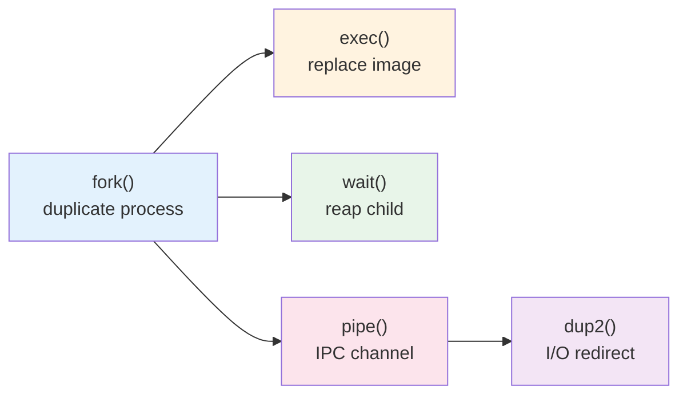
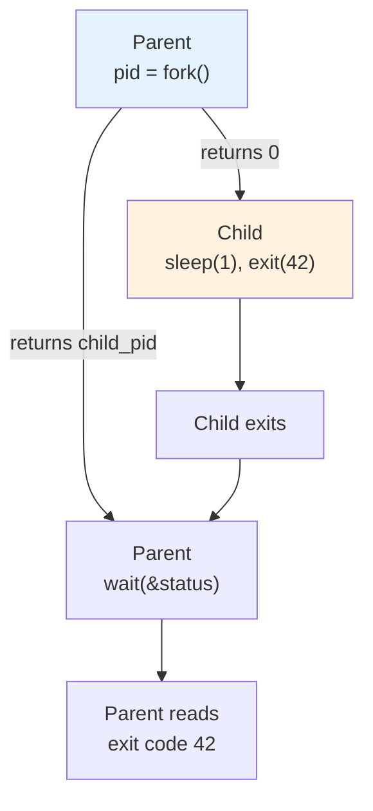
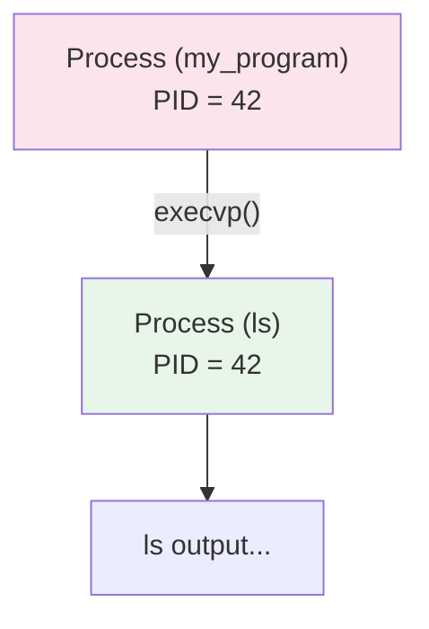
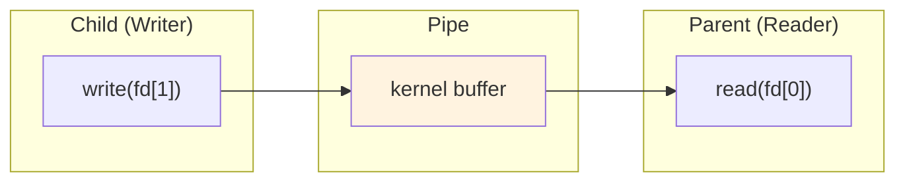
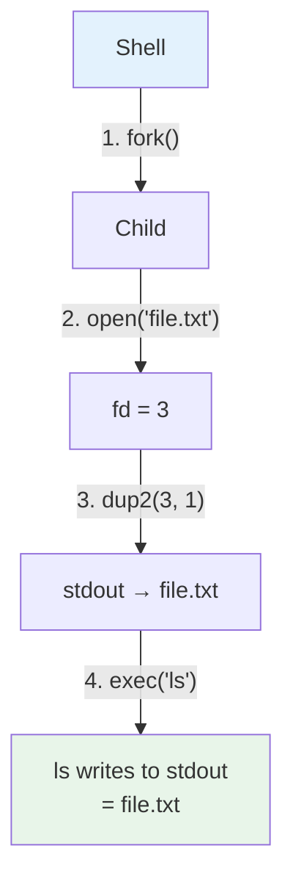
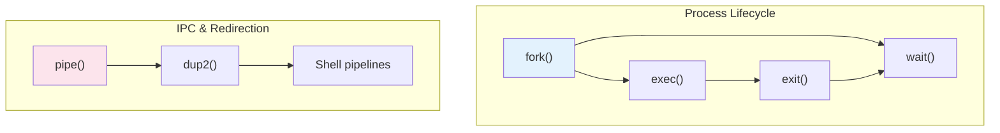

# Operating Systems Lab

## Week 2 — Process System Calls

Korea University Sejong Campus, Department of Computer Science & Software

---

# Lab Overview

- **Goal**: Practice core UNIX process system calls through C programs
- **Duration**: ~50 minutes · 4 labs
- **Topics**: `fork()`, `exec()`, `wait()`, `pipe()`, `dup()`



---

# Lab 1: fork() and wait() — Problem

<div class="text-left text-base leading-8">

### Task

Write a program that demonstrates process creation with `fork()` and child process management with `wait()`.

**Requirements:**

1. Call `fork()` to create a child process
2. In the **child**: print its own PID and parent's PID, simulate work with `sleep(1)`, then exit with code `42`
3. In the **parent**: wait for the child with `wait(&status)`, then retrieve and print the child's exit code using `WIFEXITED` / `WEXITSTATUS`
4. **Bonus**: Create 3 children in a loop, each exiting at different times — observe the termination order

**Think about:**
- What does `fork()` return to the parent vs. the child?
- What happens if you don't call `wait()`?
- What happens if a child doesn't call `exit()`?

</div>

<div class="text-right text-sm text-gray-400 pt-2">

📁 Skeleton: `examples/skeletons/lab1_fork_basic.c`

</div>

---

# Lab 1: fork() and wait() — Solution

<div class="grid grid-cols-2 gap-4">
<div>

```c
pid_t pid = fork();
if (pid == 0) {
    // Child process
    printf("Child PID: %d\n", getpid());
    sleep(1);
    exit(42);
} else {
    // Parent process
    int status;
    wait(&status);
    if (WIFEXITED(status))
        printf("Exit code: %d\n",
               WEXITSTATUS(status));
}
```

</div>
<div>



</div>
</div>

<div class="text-left text-sm pt-2">

- `fork()` returns **0** to child, **child PID** to parent — this is how you distinguish the two
- `wait(NULL)` blocks until any child terminates; `wait(&status)` also captures exit info
- Without `wait()`, the child becomes an **orphan** (reparented to init) or a **zombie** (if it exits first)
- Children without `exit()` continue the parent's code → **fork bomb** in loops!

</div>

<div class="text-right text-sm text-gray-400">

📁 Solution: `examples/solutions/lab1_fork_basic.c`

</div>

---

# Lab 2: exec() — Problem

<div class="text-left text-base leading-8">

### Task

Write a program that demonstrates how `exec()` replaces the current process image with a new program.

**Requirements:**

1. Use `execl()` to run `/bin/echo` with a full path
2. Use `execlp()` to run `ls -l -h /tmp` using PATH search
3. Use `execvp()` to run a command with an argument array
4. Demonstrate the **fork() + exec() + wait()** pattern
5. Show what happens when `exec()` **fails** (nonexistent program)

**Think about:**
- Why does code after a successful `exec()` never run?
- What is the difference between `l` (list) vs `v` (vector) vs `p` (PATH)?
- Why should `exec()` always be called in a child, not the parent?

</div>

<div class="text-right text-sm text-gray-400 pt-2">

📁 Skeleton: `examples/skeletons/lab2_exec_example.c`

</div>

---

# Lab 2: exec() — Solution

<div class="grid grid-cols-2 gap-4">
<div>

```c
// fork + exec + wait pattern
pid_t pid = fork();
if (pid == 0) {
    // Child: replace with new program
    char *args[] = {"ls", "-l", NULL};
    execvp("ls", args);
    // Only reached if exec fails
    perror("exec failed");
    exit(127);
} else {
    // Parent: wait for child
    int status;
    waitpid(pid, &status, 0);
}
```

**exec() family naming:**

| Suffix | Meaning |
|--------|---------|
| `l` | Arguments as a list |
| `v` | Arguments as an array |
| `p` | Search PATH for program |
| `e` | Specify environment |

</div>
<div>



**Key points:**

- `exec()` replaces **all** of code, data, heap, stack with the new program
- **PID does not change** — same process, different program
- If exec succeeds, nothing after it runs
- If exec fails, it returns `-1` — **must** call `exit()` to prevent the child from continuing the parent's code
- Exit code `127` = "command not found" (shell convention)

</div>
</div>

<div class="text-right text-sm text-gray-400">

📁 Solution: `examples/solutions/lab2_exec_example.c`

</div>

---

# Lab 3: pipe() — Problem

<div class="text-left text-base leading-8">

### Task

Write a program that demonstrates inter-process communication using `pipe()`.

**Requirements:**

1. **Parent → Child**: Parent sends a string message through a pipe, child reads and prints it
2. **Bidirectional**: Use 2 pipes for two-way communication (parent sends question, child sends reply)
3. **Command pipeline**: Implement `echo hello world | wc -w` using pipe + fork + dup2 + exec

**Think about:**
- Why must `pipe()` be called **before** `fork()`?
- Why must unused pipe ends always be `close()`d?
- What happens if you don't close the write end — will `read()` ever return 0 (EOF)?

</div>

<div class="text-right text-sm text-gray-400 pt-2">

📁 Skeleton: `examples/skeletons/lab3_pipe_example.c`

</div>

---

# Lab 3: pipe() — Solution

<div class="grid grid-cols-2 gap-4">
<div>

```c
int fd[2];
pipe(fd);  // fd[0]=read, fd[1]=write

if (fork() == 0) {
    close(fd[0]);  // close unused read end
    char *msg = "hello from child";
    write(fd[1], msg, strlen(msg));
    close(fd[1]);
    exit(0);
} else {
    close(fd[1]);  // close unused write end
    char buf[64] = {0};
    read(fd[0], buf, sizeof(buf));
    printf("Received: %s\n", buf);
    close(fd[0]);
    wait(NULL);
}
```

</div>
<div>



**Key rules:**
- `pipe()` before `fork()` — both processes share the same fds
- **Always close unused ends** — if write end stays open, `read()` blocks forever (no EOF)
- Pipe is **unidirectional** — need 2 pipes for two-way communication
- If buffer is full, `write()` blocks until reader consumes data

</div>
</div>

<div class="text-right text-sm text-gray-400">

📁 Solution: `examples/solutions/lab3_pipe_example.c`

</div>

---

# Lab 4: dup2() and I/O Redirection — Problem

<div class="text-left text-base leading-8">

### Task

Write a program that demonstrates I/O redirection using `dup2()`.

**Requirements:**

1. **Output redirection** (`>`): Redirect stdout to a file, then run `echo` — verify output goes to the file
2. **Input redirection** (`<`): Create a file with 5 lines, redirect stdin from it, then run `wc -l`
3. **Combined** (`sort < input > output`): Redirect both stdin and stdout, then run `sort`
4. **Bonus**: Demonstrate `dup()` and show that both the original and duplicated fd share the same file offset

**Think about:**
- Why must `dup2()` be called **before** `exec()`?
- Why close the original fd after `dup2()`?
- How does the fd table survive across `exec()`?

</div>

<div class="text-right text-sm text-gray-400 pt-2">

📁 Skeleton: `examples/skeletons/lab4_redirect.c`

</div>

---

# Lab 4: dup2() and I/O Redirection — Solution

<div class="grid grid-cols-2 gap-4">
<div>

```c
// Output redirection: cmd > file
int fd = open("output.txt",
    O_WRONLY | O_CREAT | O_TRUNC, 0644);
dup2(fd, STDOUT_FILENO);  // stdout → file
close(fd);                 // close original
execlp("echo", "echo", "Hello!", NULL);
```

```c
// Input redirection: cmd < file
int fd = open("input.txt", O_RDONLY);
dup2(fd, STDIN_FILENO);   // stdin ← file
close(fd);
execlp("wc", "wc", "-l", NULL);
```

**Redirection summary:**

| Shell | System calls |
|-------|-------------|
| `> file` | `open(O_WRONLY\|O_CREAT\|O_TRUNC)` + `dup2(fd, 1)` |
| `< file` | `open(O_RDONLY)` + `dup2(fd, 0)` |
| `>> file` | `open(O_WRONLY\|O_CREAT\|O_APPEND)` + `dup2(fd, 1)` |

</div>
<div>

**How `ls > file.txt` works in a shell:**



**Key points:**
- `dup2()` before `exec()` — the new program inherits the modified fd table
- Close original fd after `dup2()` to avoid fd leak
- The fd table survives `exec()` — this is why redirection works
- Pattern: `fork() → dup2() → exec()` in child, `wait()` in parent

</div>
</div>

<div class="text-right text-sm text-gray-400">

📁 Solution: `examples/solutions/lab4_redirect.c`

</div>

---

# Key Takeaways



| Syscall | Purpose |
|---|---|
| `fork()` | Create child process (copy of parent) |
| `exec()` | Replace process image with new program |
| `wait()` | Block until child exits; reap zombie |
| `pipe()` | Create one-way IPC channel |
| `dup2()` | Redirect file descriptors |

**Shell command** `cmd1 | cmd2` = fork + pipe + dup2 + exec (×2) + wait

> Next week: we go inside xv6 and read the kernel source that implements these calls.
