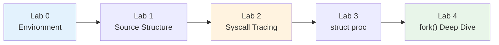

# Operating Systems Lab

## Week 3 — Exploring xv6 Internals

Korea University Sejong Campus, Department of Computer Science & Software

---

# Lab Overview

- **Goal**: Navigate xv6 kernel source and trace how system calls work end-to-end
- **Duration**: ~50 minutes · 5 labs (Lab 0–4)



---

# Lab 0: Environment Setup — Prerequisites

xv6-riscv requires a **RISC-V cross-compiler** and **QEMU emulator**.

> **QEMU** = Quick EMUlator — a software emulator that can run an entire OS for a different CPU architecture.
> We use it to run xv6 (built for RISC-V) on your x86/ARM laptop, without needing real RISC-V hardware.

<div class="grid grid-cols-3 gap-4">
<div>

### macOS (Homebrew)

```bash
brew install qemu
brew install riscv64-elf-gcc
```

</div>
<div>

### Ubuntu / Debian

```bash
sudo apt update
sudo apt install -y git build-essential \
  qemu-system-misc \
  gcc-riscv64-linux-gnu \
  binutils-riscv64-linux-gnu
```

</div>
<div>

### Windows (WSL2)

```powershell
# PowerShell (Administrator):
wsl --install -d Ubuntu
```

Restart, then in WSL Ubuntu terminal follow the Ubuntu instructions on the left.

> Work in `~/`, **not** `/mnt/c/` (very slow)

</div>
</div>

<div class="mt-4 text-sm">

**Clone xv6** (all platforms):
```bash
git clone https://github.com/mit-pdos/xv6-riscv.git
```

**Detailed guide**: [`setup_xv6_env.md`](../week02/2_lab/setup_xv6_env.md) · **MIT 6.1810 Tools**: [pdos.csail.mit.edu/6.828/2024/tools.html](https://pdos.csail.mit.edu/6.828/2024/tools.html) · **xv6 repo**: [github.com/mit-pdos/xv6-riscv](https://github.com/mit-pdos/xv6-riscv)

</div>

---

# Lab 0: Verify Build & Troubleshooting

<div class="grid grid-cols-2 gap-4">
<div>

### Build & Run

```bash
cd xv6-riscv
make qemu
```

Expected output:
```
xv6 kernel is booting

hart 2 starting
hart 1 starting
init: starting sh
$
```

Try `ls`, `echo hello` in the xv6 shell.
**Exit QEMU**: press **Ctrl-A**, then **X**.

</div>
<div>

### Common Issues

| Problem | Fix |
|---|---|
| `riscv64 version of GCC not found` | Set `TOOLPREFIX` manually (see below) |
| QEMU version < 5.0 | Upgrade QEMU |
| macOS linker errors | Use `brew install riscv64-elf-gcc` (not linux-gnu) |
| WSL2 "KVM not available" | Harmless warning — ignore |

**TOOLPREFIX** — if auto-detection fails:
```bash
# Check what's installed:
ls /usr/bin/riscv64-*

# Then set explicitly:
make TOOLPREFIX=riscv64-linux-gnu- qemu
# or on macOS:
make TOOLPREFIX=riscv64-elf- qemu
```

</div>
</div>

---

# Lab 1: xv6 Source Structure

| File | Purpose |
|---|---|
| `proc.h` | `struct proc` definition |
| `proc.c` | fork, exit, wait, scheduler |
| `syscall.c` | syscall dispatch table |
| `sysproc.c` | syscall handlers |
| `trap.c` | trap entry from user space |
| `usys.pl` | generates user-space stubs |

---

# Lab 2: System Call Tracing

**Full path of `fork()` from user space to kernel:**

```
  User program: fork()
        │
        ▼
  usys.S:  li a7, SYS_fork  →  ecall
        │
        ▼
  trap.c:  usertrap()        ← handles all user traps
        │
        ▼
  syscall.c:  syscall()      ← reads a7, dispatch table lookup
        │
        ▼
  sysproc.c:  sys_fork()     ← thin wrapper
        │
        ▼
  proc.c:  kfork()           ← does the actual work
```

**Exercise**: Add a `printf` in `sys_fork()` and rebuild to confirm you found the right spot.

<div class="mt-4 text-sm opacity-80">

**Materials**: `examples/skeletons/lab2_syscall_trace.patch` (TODO template) · `examples/solutions/lab2_syscall_trace.patch` (answer)
**Test program**: `examples/skeletons/lab2_trace.c` (skeleton) · `examples/solutions/lab2_trace.c` (answer)

</div>

---

# Lab 2: How to Run the Trace Exercise

<div class="grid grid-cols-2 gap-4">
<div>

### Step 1 — Apply the kernel patch

```bash
# From the repository root:
cd xv6-riscv

# Apply the solution (or skeleton) patch
git apply ../lectures/week03/2_lab/\
examples/solutions/lab2_syscall_trace.patch
```

### Step 2 — Add the test program

```bash
# Copy the test program into xv6 user/
cp ../lectures/week03/2_lab/\
examples/solutions/lab2_trace.c \
user/lab2_trace.c
```

</div>
<div>

### Step 3 — Edit the Makefile

Open `xv6-riscv/Makefile` and find the `UPROGS` list. Add:

```makefile
UPROGS=\
  ...
  $U/_lab2_trace\
```

### Step 4 — Build and run

```bash
make clean && make qemu
```

At the xv6 shell prompt:
```
$ lab2_trace
```

You should see `[TRACE] sys_fork() called by ...` from the kernel.

**Exit QEMU**: press **Ctrl-A**, then **X**.

</div>
</div>

---

# Lab 3: struct proc Analysis

**Process state machine** — defined in `kernel/proc.h`:

```
                allocproc()        fork()/userinit()       scheduler
  UNUSED ──────────▶ USED ──────────────▶ RUNNABLE ──────────▶ RUNNING
    ▲                                        ▲                  │  │
    │                                        │   yield()/       │  │
    │                                        │   interrupt      │  │
    │                                        ◀──────────────────┘  │
    │                                        ▲                     │
    │                              wakeup()  │       sleep()       │
    │                                        │         │           │
    │                                     SLEEPING ◀───┘           │
    │                                                              │
    │                                                    exit()    │
    │                     wait() reaps                             │
    └──────────────────────── ZOMBIE ◀─────────────────────────────┘
```

**Key fields**: `state`, `pid`, `pagetable`, `trapframe`, `context`, `ofile[]`, `parent`

- **Exercise**: Which fields change at each state transition?

---

# Lab 3: struct proc — Full Definition

```c
struct proc {
  struct spinlock lock;
  enum procstate state;        // UNUSED → USED → RUNNABLE → RUNNING → ZOMBIE
  void *chan;                  // sleep channel (if SLEEPING)
  int killed;                 // pending kill signal
  int xstate;                 // exit status for parent
  int pid;                    // process ID

  struct proc *parent;        // parent process (protected by wait_lock)

  uint64 kstack;              // kernel stack virtual address
  uint64 sz;                  // process memory size (bytes)
  pagetable_t pagetable;      // user page table
  struct trapframe *trapframe;// saved user registers (for trampoline.S)
  struct context context;     // saved kernel registers (for swtch.S)
  struct file *ofile[NOFILE]; // open file descriptors
  struct inode *cwd;          // current working directory
  char name[16];              // process name (for debugging)
};
```

---

# Lab 4: fork() Implementation Deep Dive

```
  1. allocproc()         ── get new proc slot, pid, kstack, trapframe
        │
  2. uvmcopy()           ── copy parent's page table + memory
        │
  3. Copy trapframe      ── child returns from fork() too
        │
  4. Set a0 = 0          ── child sees fork() return 0    ★
        │
  5. Copy ofile[]        ── share open file descriptors
        │
  6. Set parent,         ── child is ready to run
     state = RUNNABLE
        │
  7. Return child PID    ── to parent
```

**Discussion questions**:
- Why does the child need its **own** trapframe copy?
- What would happen if step 4 (`a0 = 0`) were skipped?
- Why does `uvmcopy` copy **all** pages? (Hint: Week 12 — COW fork)

---

# Key Takeaways

| Concept | Key Insight |
|---|---|
| **xv6** | ~10K lines of C — small enough to read entirely |
| **Syscall path** | user → `ecall` → `usertrap()` → `syscall()` → handler → impl |
| **struct proc** | Kernel's complete view of a process (scheduling, memory, files) |
| **fork()** | `uvmcopy` = heavy lifting; `trapframe->a0 = 0` = child return value |

```
  What you explored today:

  Source Structure ──▶ Syscall Path ──▶ struct proc Lifecycle ──▶ fork() Implementation
```

> Upcoming: threads, scheduling, and synchronization — all built on top of what you explored today.
