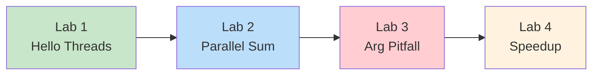
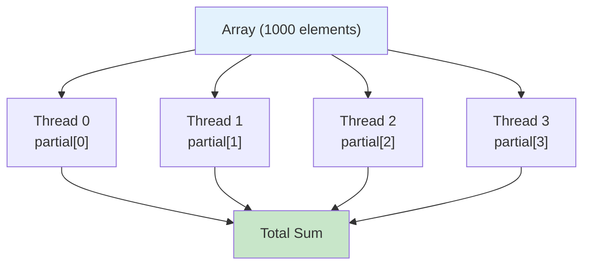
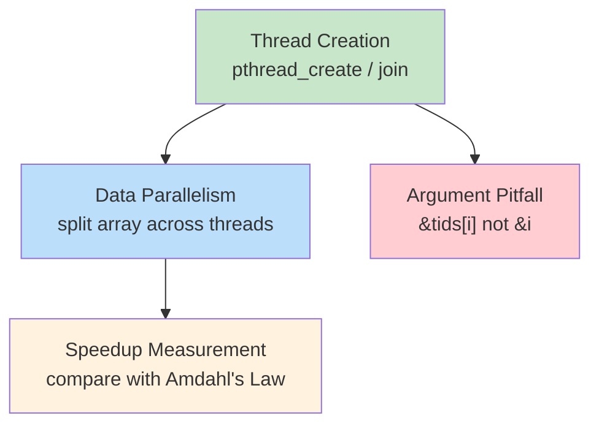

# Operating Systems Lab

## Week 4 — Pthreads: Thread Creation, Data Parallelism, and Speedup

Korea University Sejong Campus, Department of Computer Science & Software

---

# Lab Overview

**Duration**: ~50 minutes · 4 labs



**Setup**:

```bash
cd examples/
gcc -Wall -pthread -o lab1_hello_threads lab1_hello_threads.c
gcc -Wall -pthread -o lab2_parallel_sum  lab2_parallel_sum.c
gcc -Wall -pthread -o lab3_arg_pitfall   lab3_arg_pitfall.c
gcc -Wall -O2 -pthread -o lab4_speedup   lab4_speedup.c
```

---

# Lab 1: Hello Threads

**Goal**: Create and join threads with `pthread_create` / `pthread_join`

```bash
./lab1_hello_threads        # 4 threads (default)
./lab1_hello_threads 8      # 8 threads
```

**Key API** (from Ch 4.4):

```c
pthread_create(&tid, NULL, func, arg);   // create thread
pthread_join(tid, NULL);                 // wait for thread
```

**Observe**: Run multiple times — the print order is **non-deterministic** (depends on OS scheduling).

**Why?** Threads are independently scheduled by the OS. There is no guaranteed execution order.

<div class="text-right text-sm text-gray-400 pt-4">

Skeleton: `examples/skeletons/lab1_hello_threads.c` · Solution: `examples/solutions/lab1_hello_threads.c`

</div>

---

# Lab 1: Thread Lifecycle

```text
Main Thread         Thread 0       Thread 1       Thread 2       Thread 3
    |
    |--create()----> starts
    |--create()-------------------> starts
    |--create()----------------------------------> starts
    |--create()---------------------------------------------------> starts
    |                  |              |              |              |
    |             (concurrent execution — order depends on scheduler)
    |                  |              |              |              |
    |                  |              |         printf("Hello 2!")  |
    |             printf("Hello 0!") |              |              |
    |                  |              |              |         printf("Hello 3!")
    |                  |         printf("Hello 1!") |              |
    |                  |              |              |              |
    |--join(T0)------> done          |              |              |
    |--join(T1)--------------------> done           |              |
    |--join(T2)----------------------------------> done            |
    |--join(T3)---------------------------------------------------> done
    |
 "All threads finished."
```

Without `pthread_join()`, the main thread could exit before child threads finish.

---

# Lab 2: Data Parallel Array Sum

**Goal**: Split an array across threads — each computes a **partial sum**

<div class="grid grid-cols-2 gap-4">
<div>

```text
Array: [1, 2, 3, ..., 1000]

Thread 0: sum [  1 ~ 250 ] = 31375
Thread 1: sum [251 ~ 500 ] = 93875
Thread 2: sum [501 ~ 750 ] = 156375
Thread 3: sum [751 ~ 1000] = 218875
                              ──────
Total                       = 500500 ✓
```

</div>
<div>



</div>
</div>

This is **data parallelism** (Ch 4.2): same operation, different data subsets.

<div class="text-right text-sm text-gray-400 pt-2">

Skeleton: `examples/skeletons/lab2_parallel_sum.c` · Solution: `examples/solutions/lab2_parallel_sum.c`

</div>

---

# Lab 2: Key Code Pattern

```c
/* Each thread computes its own chunk — no sharing conflict */
void *sum_array(void *arg)
{
    int id    = ((struct thread_arg *)arg)->id;
    int chunk = ARRAY_SIZE / nthreads;
    int start = id * chunk;
    int end   = (id == nthreads - 1) ? ARRAY_SIZE : start + chunk;

    partial_sum[id] = 0;                        // separate index per thread
    for (int i = start; i < end; i++)
        partial_sum[id] += array[i];

    return NULL;
}
```

**Why `partial_sum[id]` instead of a shared variable?**
- Each thread writes to its **own index** — no conflict
- If all threads wrote to a single `total` variable, a **race condition** would occur
- Race conditions and synchronization are covered in Ch 6

---

# Lab 3: Thread Argument Pitfall

**Common bug**: passing `&i` (loop variable address) to `pthread_create`

<div class="grid grid-cols-2 gap-4">
<div>

**Buggy**:

```c
for (int i = 0; i < 4; i++)
    pthread_create(&t[i], NULL,
                   func, &i);  // all share &i!
```

Output (non-deterministic):

```text
Thread received id = 2
Thread received id = 4
Thread received id = 4
Thread received id = 4
```

</div>
<div>

**Correct**:

```c
int tids[4];
for (int i = 0; i < 4; i++) {
    tids[i] = i;               // own copy
    pthread_create(&t[i], NULL,
                   func, &tids[i]);
}
```

Output (always correct):

```text
Thread received id = 0
Thread received id = 1
Thread received id = 2
Thread received id = 3
```

</div>
</div>

> All threads share the same `&i` address. By the time a thread reads it, `i` may have changed.

<div class="text-right text-sm text-gray-400 pt-2">

Skeleton: `examples/skeletons/lab3_arg_pitfall.c` · Solution: `examples/solutions/lab3_arg_pitfall.c`

</div>

---

# Lab 3: Why Does This Happen?

```text
Main (loop)              Thread 0             Thread 1
    |
  i = 0
    |--create(&i)------> starts
  i = 1                    |
    |--create(&i)------------------------------> starts
  i = 2                    |                      |
    :                 id = *(&i)             id = *(&i)
    :                 reads 2!               reads 2!
    :                      |                      |
    :               Both got id=2 instead of 0, 1!
```

**The fix**: store each value in a **separate memory location** (`tids[i]`), so each thread's pointer remains stable even as the loop advances.

---

# Lab 4: Speedup & Amdahl's Law

**Goal**: Measure how speedup scales with thread count

```bash
./lab4_speedup
```

**Expected output** (varies by machine):

| Threads | Time (sec) | Speedup |
|---------|-----------|---------|
| 1 | 0.12 | 1.00x |
| 2 | 0.07 | ~1.7x |
| 4 | 0.04 | ~3.0x |
| 8 | 0.03 | ~4.0x |

**Amdahl's Law** (Ch 4.2): speedup $\leq \frac{1}{S + \frac{1-S}{N}}$

- If S = 0 (fully parallel): ideal speedup = N
- If S = 10%: max speedup with 8 threads = **4.71x** (not 8x)
- Serial overhead: thread creation, joining, memory bus contention

<div class="text-right text-sm text-gray-400 pt-2">

Skeleton: `examples/skeletons/lab4_speedup.c` · Solution: `examples/solutions/lab4_speedup.c`

</div>

---

# Lab 4: Speedup vs Ideal

<div class="text-left text-base leading-8">

| Threads | Ideal (S=0) | Reality (S>0) |
|---------|------------|---------------|
| 1 | 1.0x | 1.0x |
| 2 | 2.0x | ~1.7x |
| 4 | 4.0x | ~3.0x |
| 8 | **8.0x** | **~4.0x** |

</div>

**Why is actual speedup less than ideal?**

1. **Thread creation/join overhead** (serial)
2. **Memory bus contention** — threads compete for RAM bandwidth
3. **Cache effects** — data spread across cores may cause cache misses
4. Amdahl's Law: even a small serial fraction limits the gain

---

# Key Takeaways



**Pthreads pattern used throughout**:

```c
for (int i = 0; i < N; i++) {
    tids[i] = i;
    pthread_create(&threads[i], NULL, func, &tids[i]);
}
for (int i = 0; i < N; i++)
    pthread_join(threads[i], NULL);
```

**Next week**: Implicit threading, fork/join, OpenMP, thread cancellation, TLS (Ch 4.5–4.8)
