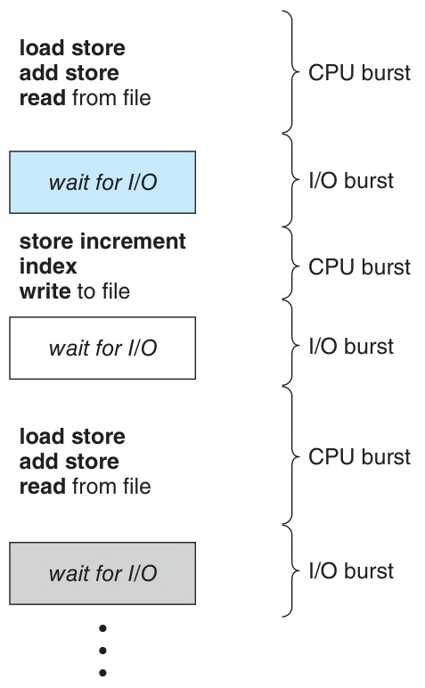
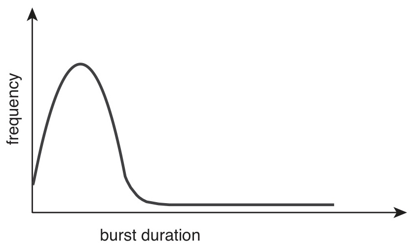
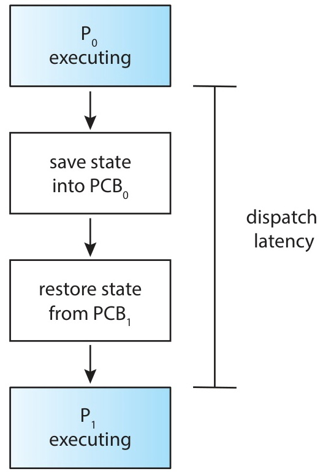
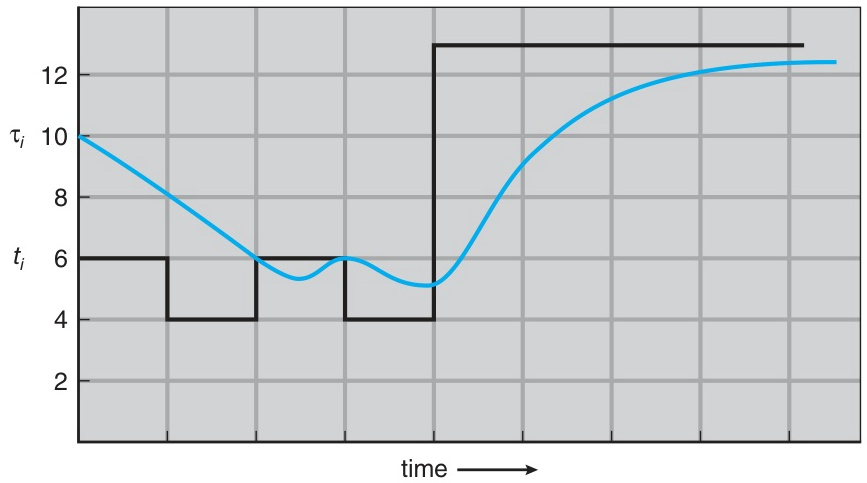
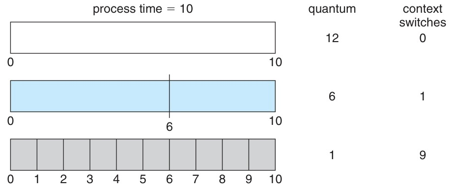
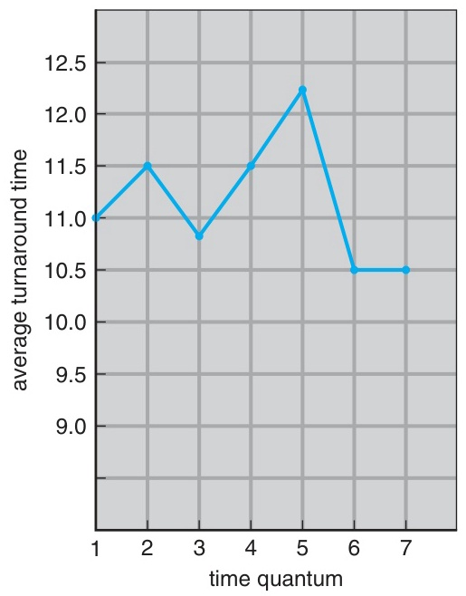

# CPU Scheduling 1
## Week 6

Operating Systems Ch 5 (Sections 5.1 – 5.3)

---

# Today's Schedule

| Hour | Content |
|------|---------|
| **1st** | **Quiz (Beginning)** → Theory Lecture (Part 1) |
| **2nd** | Theory Lecture (Part 2) |
| **3rd** | Hands-on Lab |

---

# This Week's Learning Objectives

<div class="text-left text-lg leading-10">

1. Understand the CPU-I/O Burst Cycle and explain the need for scheduling
2. Distinguish between Preemptive vs Nonpreemptive scheduling
3. Explain the role of the Dispatcher and Dispatch Latency
4. List and explain the 5 Scheduling Criteria
5. Understand FCFS, SJF, SRTF, RR algorithms and draw Gantt Charts
6. Perform CPU burst prediction using Exponential Averaging

</div>

---
layout: section
---

# Part 1
## Basic Concepts (5.1)

---

# Multiprogramming and CPU Scheduling

<div class="text-left text-lg leading-10">

**Key Idea**: Keep the CPU busy at all times to **maximize utilization**

- In a single CPU core system, only one process can run at a time
- While a process waits for I/O, the CPU is **idle** — wasted
- **Multiprogramming**: Keep multiple processes in memory; when one waits, allocate the CPU to another process
- CPU scheduling is one of the **most fundamental functions** of an operating system

</div>

---

# CPU-I/O Burst Cycle

<div class="text-left text-lg leading-10">

Process execution consists of a repeating cycle of **CPU bursts** and **I/O bursts**

</div>


<p class="text-xs text-gray-500 text-center">Silberschatz, Figure 5.1 — Alternating sequence of CPU and I/O bursts</p>

<div class="text-left text-base leading-8">

- **CPU burst**: The interval during which the CPU executes instructions
- **I/O burst**: The interval during which the process waits for I/O completion
- In the final CPU burst, the process requests **termination via a system call**

</div>

---

# CPU-I/O Burst Cycle — Detailed Flow

<div class="text-left text-lg leading-10">

Expressing a process's lifecycle in code:

</div>

```c
// Process execution pattern (pseudocode)
while (process_not_terminated) {
    // === CPU Burst ===
    execute_instructions();   // load, store, add, ...

    // === I/O Burst ===
    request_io();             // read from file, write to file, ...
    wait_for_io_completion(); // blocking
}
terminate();                  // Terminates after the last CPU burst
```

<div class="text-left text-base leading-8">

- All processes follow this pattern, but the **burst length and frequency** differ
- This difference is the key basis for choosing scheduling algorithms

</div>

---

# CPU Burst Distribution (Figure 5.2)

<div class="text-left text-lg leading-10">

The distribution of CPU burst lengths follows an **exponential or hyperexponential** decay pattern

</div>


<p class="text-xs text-gray-500 text-center">Silberschatz, Figure 5.2 — Histogram of CPU-burst durations</p>

<div class="text-left text-base leading-8">

- **Short CPU bursts** are very frequent — most bursts are short
- **Long CPU bursts** occur rarely

</div>

---

# I/O-bound vs CPU-bound Process

<div class="text-left text-lg leading-10">

Process classification based on CPU burst distribution

</div>

| Category | I/O-bound Process | CPU-bound Process |
|------|-------------------|-------------------|
| CPU burst | Many **short** bursts | Few **long** bursts |
| I/O burst | Frequent I/O requests | Rare I/O requests |
| Examples | Web server, database | Scientific computation, video encoding |
| Scheduling needs | Fast response time | Long CPU allocation time |

<div class="text-left text-base leading-8">

- **Scheduling algorithms** must efficiently handle both types
- This distribution characteristic forms the theoretical basis for algorithms like SJF and RR

</div>

---

# CPU Scheduler (Short-term Scheduler)

<div class="text-left text-lg leading-10">

When the CPU becomes idle, the **ready queue** is used to select the next process to run

</div>

```text
                    ┌─────────────┐
  new process ───►  │ Ready Queue │ ───► CPU Scheduler ───► CPU
                    └─────────────┘     selection algorithm
                          ▲
                          │
                    I/O completion, etc.
```

<div class="text-left text-base leading-8">

- **CPU Scheduler** = Short-term Scheduler
- The ready queue does not have to be FIFO
  - Can be implemented as a FIFO queue, **priority queue**, tree, linked list, etc.
- Records in the queue are typically **PCBs (Process Control Blocks)**
- The internal order of the queue is determined by the scheduling algorithm

</div>

---

# When Scheduling Occurs — 4 Circumstances

<div class="text-left text-lg leading-10">

**4 circumstances** where CPU scheduling decisions are needed:

</div>

| No. | State Transition | Example | Choice |
|------|----------|------|----------|
| **1** | Running → Waiting | I/O request, wait() call | No choice |
| **2** | Running → Ready | Interrupt occurs (timer, etc.) | **Choice exists** |
| **3** | Waiting → Ready | I/O completion | **Choice exists** |
| **4** | Terminates | Process terminates | No choice |

<div class="text-left text-base leading-8">

- Circumstances **1, 4**: A new process must be selected (no choice)
- Circumstances **2, 3**: Depends on the scheduling scheme (choice exists)

</div>

---

# Nonpreemptive vs Preemptive Scheduling

<div class="text-left text-lg leading-10">

| Category | Nonpreemptive | Preemptive |
|------|----------------------|-------------------|
| Scheduling points | Only at **1, 4** | At **1, 2, 3, 4** (all) |
| CPU release | Process **voluntarily** releases | OS can **forcibly** take away |
| Also known as | Cooperative scheduling | - |
| Usage | Early OS | **Most modern OS** |

</div>

<div class="text-left text-base leading-8">

- **Nonpreemptive**: Process voluntarily releases the CPU (termination or I/O wait)
- **Preemptive**: OS can forcibly reclaim the CPU via timer interrupt, etc.
- Windows, macOS, Linux, UNIX — all use **preemptive** scheduling

</div>

---

# Issues with Preemptive Scheduling

<div class="text-left text-lg leading-10">

Preemptive scheduling is powerful but has **caveats**:

</div>

<div class="text-left text-base leading-8">

**1. Race Condition**
- Preemption while modifying shared data → another process reads inconsistent data
- → **Synchronization mechanisms** (mutex, semaphore, etc.) are needed (covered in detail in Chapter 6)

**2. Preemption in Kernel Mode**
- Preemption during kernel data structure modification within a system call → kernel inconsistency
- **Nonpreemptive kernel**: Defer context switch until system call completes (simple but unsuitable for real-time)
- **Preemptive kernel**: Protect kernel data with mutex locks, etc. (most modern OS)

**3. Interrupt Handling**
- Interrupts can occur at any time → disable interrupts in critical sections

</div>

---

# Dispatcher

<div class="grid grid-cols-[1fr_1fr] gap-4">
<div class="text-left text-base leading-8">

**Dispatcher**: The module that actually hands over CPU control to the process selected by the Scheduler

Three roles of the Dispatcher:
1. Perform **context switch** (save current process state → restore new process state)
2. Switch to **user mode**
3. Jump to the appropriate location (**PC**) of the new process

</div>
<div>


<p class="text-xs text-gray-500 text-center">Silberschatz, Figure 5.3 — The role of the dispatcher</p>

</div>
</div>

---

# Dispatch Latency

<div class="text-left text-lg leading-10">

**Dispatch Latency** = The time it takes for the Dispatcher to stop one process and start running another

</div>

<div class="text-left text-base leading-8">

- Occurs on every context switch, so it should be **as short as possible**
- Checking context switch counts on Linux:

</div>

```bash
# System-wide context switch count (1-second interval, 3 times)
vmstat 1 3

# Context switch count for a specific process
cat /proc/<PID>/status | grep ctxt
# voluntary_ctxt_switches:    150   (voluntary: I/O wait, etc.)
# nonvoluntary_ctxt_switches: 8     (involuntary: time slice expired, etc.)
```

<div class="text-left text-base leading-8">

- **Voluntary context switch**: Process voluntarily releases the CPU due to lack of resources
- **Nonvoluntary context switch**: OS forces a switch due to time slice expiration, etc.

</div>

---
layout: section
---

# Part 2
## Scheduling Criteria (5.2)

---

# Scheduling Criteria — Overview

<div class="text-left text-lg leading-10">

Five criteria for **comparing** and **evaluating** scheduling algorithms:

</div>

| Criterion | Description | Optimization Direction |
|------|------|------------|
| **CPU Utilization** | CPU usage rate (%) | **Maximize** |
| **Throughput** | Number of processes completed per unit time | **Maximize** |
| **Turnaround Time** | Total time from submission to completion | **Minimize** |
| **Waiting Time** | Total time spent waiting in the ready queue | **Minimize** |
| **Response Time** | Time from submission to first response | **Minimize** |

---

# CPU Utilization & Throughput

<div class="text-left text-lg leading-10">

**CPU Utilization**
- The proportion of time the CPU is performing useful work
- Theoretical range: 0% to 100%
- Real systems: around **40%** under light load, **90%** under heavy load
- Can be checked with the `top` command on Linux

**Throughput**
- Number of processes completed per unit time
- Long processes: one every few seconds
- Short transactions: dozens per second

</div>

<div class="text-left text-base leading-8">

- The goal is to **maximize** both criteria
- They can be in a trade-off relationship (context switch overhead)

</div>

---

# Turnaround Time & Waiting Time

<div class="text-left text-lg leading-10">

**Turnaround Time**
- Total time from process **submission** to **completion**
- = Sum of ready queue wait + CPU execution + I/O wait time

</div>

```text
Turnaround Time = Completion Time − Arrival Time
```

<div class="text-left text-lg leading-10">

**Waiting Time**
- Total time spent **waiting** in the ready queue
- The only time that the scheduling algorithm **directly affects**
- CPU execution time and I/O time are independent of the algorithm

</div>

```text
Waiting Time = Turnaround Time − Burst Time
             (for a single burst, with no I/O)
```

---

# Response Time

<div class="text-left text-lg leading-10">

**Response Time**
- Time from process **submission** to the moment the **first response is produced**
- The most important criterion in interactive systems

</div>

```text
Response Time = First Run Time − Arrival Time
```

<div class="text-left text-base leading-8">

**Turnaround Time vs Response Time**

| Comparison | Turnaround Time | Response Time |
|------|-----------------|---------------|
| Measured interval | Submission to **completion** | Submission to **first response** |
| Important for | Batch system | **Interactive** system |
| Example | 30 seconds to complete the job | 0.5 seconds to first output |

- In interactive systems, **minimizing the variance** of response time is important
- **Predictable** response time is more favorable for user satisfaction than average

</div>

---

# Scheduling Criteria — Summary

<div class="text-left text-lg leading-10">

</div>

```text
┌─────────────────────────────────────────────────────────┐
│                    Maximize                              │
│  ┌──────────────────┐  ┌──────────────────┐             │
│  │ CPU Utilization   │  │ Throughput        │             │
│  │                   │  │                   │             │
│  └──────────────────┘  └──────────────────┘             │
├─────────────────────────────────────────────────────────┤
│                    Minimize                              │
│  ┌──────────────────┐  ┌──────────────────┐             │
│  │ Turnaround Time   │  │ Waiting Time      │             │
│  │                   │  │                   │             │
│  └──────────────────┘  └──────────────────┘             │
│  ┌──────────────────┐                                   │
│  │ Response Time     │                                   │
│  │                   │                                   │
│  └──────────────────┘                                   │
└─────────────────────────────────────────────────────────┘
```

<div class="text-left text-base leading-8">

- In most cases, the **average** is optimized
- In some cases, the **minimum** or **maximum** is optimized (e.g., minimizing the maximum response time)

</div>

---
layout: section
---

# Part 3
## FCFS Scheduling (5.3.1)

---

# FCFS (First-Come, First-Served)

<div class="text-left text-lg leading-10">

The **simplest** CPU scheduling algorithm: execute in **arrival order**

- Implemented with a **FIFO queue**
- When a process arrives at the ready queue, it is added to the **tail**
- When the CPU is free, it is allocated to the process at the **head**
- **Nonpreemptive** scheduling

</div>

```text
Ready Queue (FIFO):

  head ──► [ P1 ] ──► [ P2 ] ──► [ P3 ] ◄── tail
              │
              ▼
           CPU allocation
```

---

# FCFS — Example 1 (Arrival Order: P1, P2, P3)

<div class="text-left text-lg leading-10">

Process arrival order: P1 → P2 → P3 (all arrive at time 0)

</div>

| Process | Burst Time |
|---------|-----------|
| P1 | 24 ms |
| P2 | 3 ms |
| P3 | 3 ms |

```text
Gantt Chart:
┌────────────────────────────┬─────┬─────┐
│            P1              │ P2  │ P3  │
└────────────────────────────┴─────┴─────┘
0                            24    27    30
```

| Process | Waiting Time | Turnaround Time |
|---------|-------------|----------------|
| P1 | 0 | 24 |
| P2 | 24 | 27 |
| P3 | 27 | 30 |
| **Average** | **(0+24+27)/3 = 17** | **(24+27+30)/3 = 27** |

---

# FCFS — Example 2 (Arrival Order: P2, P3, P1)

<div class="text-left text-lg leading-10">

Same processes but different arrival order: P2 → P3 → P1

</div>

```text
Gantt Chart:
┌─────┬─────┬────────────────────────────┐
│ P2  │ P3  │            P1              │
└─────┴─────┴────────────────────────────┘
0     3     6                            30
```

| Process | Waiting Time | Turnaround Time |
|---------|-------------|----------------|
| P1 | 6 | 30 |
| P2 | 0 | 3 |
| P3 | 3 | 6 |
| **Average** | **(6+0+3)/3 = 3** | **(30+3+6)/3 = 13** |

<div class="text-left text-base leading-8">

- Average Waiting Time: **17 → 3** (dramatically reduced just by changing the order!)
- FCFS performance **varies significantly** depending on arrival order

</div>

---

# FCFS — Convoy Effect

<div class="text-left text-lg leading-10">

**Convoy Effect**: A phenomenon where short processes queue up behind a single process with a long CPU burst

</div>

```text
Scenario: 1 CPU-bound process + multiple I/O-bound processes

Time →  ═══════════════════════════════════════════════►

CPU:  [ CPU-bound (long burst) ........................][ I/O-1 ][ I/O-2 ][ I/O-3 ]
I/O:  [     idle (I/O device sitting idle)             ][ busy  ][ busy  ][ busy  ]
                                                       ▲
                                                       │
                                              I/O-bound processes
                                              waiting behind CPU-bound
```

<div class="text-left text-base leading-8">

- The CPU-bound process monopolizes the CPU → I/O-bound processes wait in the ready queue
- Meanwhile, the **I/O device is idle** → both CPU and I/O **utilization drops**
- **Unsuitable for interactive systems**: a single process can monopolize the CPU for a long time

</div>

---

# FCFS — Characteristics Summary

<div class="text-left text-lg leading-10">

</div>

| Characteristic | Description |
|------|------|
| Type | **Nonpreemptive** |
| Implementation | FIFO queue — very simple |
| Average Waiting Time | Generally **long** (not optimal) |
| Convoy Effect | **Occurs** (CPU-bound blocks I/O-bound) |
| Interactive suitability | **Unsuitable** (cannot distribute CPU at regular intervals) |
| Advantage | Simple to implement, easy to understand |
| Disadvantage | Performance heavily depends on arrival order |

---
layout: section
---

# Part 4
## SJF Scheduling (5.3.2)

---

# SJF (Shortest-Job-First)

<div class="text-left text-lg leading-10">

Select the process with the **shortest next CPU burst** first

- More accurate name: **Shortest-Next-CPU-Burst** Algorithm
- If burst lengths are equal → tie-breaking with **FCFS**
- Both Nonpreemptive and Preemptive versions exist

</div>

<div class="text-left text-base leading-8">

**Key property**: Guarantees **minimum average waiting time** for a given set of processes — **Optimal**

**Fundamental problem**: The next CPU burst length **cannot be known exactly**

</div>

---

# SJF — Proof of Optimality (Intuitive Understanding)

<div class="text-left text-lg leading-10">

**Why is SJF optimal?**

</div>

```text
Case 1: Long first (burst: 10, 3)
┌──────────┬───┐
│   P1(10) │P2 │    P1 wait=0, P2 wait=10  → average = 5
└──────────┴───┘
0          10  13

Case 2: Short first (burst: 3, 10)  ← SJF
┌───┬──────────┐
│P2 │  P1(10)  │    P2 wait=0, P1 wait=3   → average = 1.5
└───┴──────────┘
0   3          13
```

<div class="text-left text-base leading-8">

- Moving the **shorter process** forward: its waiting time **decreases significantly**
- The **longer process's** waiting time **increases slightly**
- Result: The overall average waiting time **decreases**
- Generalizing this shows that SJF is **provably optimal**

</div>

---

# SJF — Example (Nonpreemptive)

<div class="text-left text-lg leading-10">

All processes arrive at time 0 (nonpreemptive SJF)

</div>

| Process | Burst Time |
|---------|-----------|
| P1 | 6 ms |
| P2 | 8 ms |
| P3 | 7 ms |
| P4 | 3 ms |

```text
Gantt Chart (SJF order: P4 → P1 → P3 → P2):
┌─────┬────────┬─────────┬──────────┐
│ P4  │   P1   │   P3    │    P2    │
└─────┴────────┴─────────┴──────────┘
0     3        9         16         24
```

| Process | Waiting Time |
|---------|-------------|
| P1 | 3 |
| P2 | 16 |
| P3 | 9 |
| P4 | 0 |
| **Average** | **(3+16+9+0)/4 = 7** |

<div class="text-left text-base leading-8">

If FCFS were used? (P1→P2→P3→P4 order): average = (0+6+14+21)/4 = **10.25**

</div>

---

# The Problem with SJF — Predicting the Next Burst Length

<div class="text-left text-lg leading-10">

SJF is **optimal** but impossible to implement in practice — because the **next CPU burst length cannot be known**

Solution: **Prediction** based on past burst history

- Past CPU bursts tend to repeat with similar lengths
- Use **Exponential Averaging** for prediction

</div>

---

# Exponential Averaging — Formula

<div class="text-left text-lg leading-10">

Formula for predicting the next CPU burst:

</div>

```text
τ(n+1) = α · t(n) + (1 − α) · τ(n)
```

<div class="text-left text-base leading-8">

| Symbol | Meaning |
|------|------|
| `t(n)` | The n-th **actual** CPU burst length (most recent observed value) |
| `τ(n)` | The n-th **predicted value** (previous prediction) |
| `τ(n+1)` | The next CPU burst **predicted value** |
| `α` | Weight (0 ≤ α ≤ 1) |

**Characteristics depending on α:**

| α value | Meaning |
|------|------|
| α = 0 | `τ(n+1) = τ(n)` — Ignores recent observation, uses only past prediction |
| α = 1 | `τ(n+1) = t(n)` — Uses only the last observation, ignores past prediction |
| α = 1/2 | **Balances** recent and past values (common choice) |

</div>

---

# Exponential Averaging — Expansion

<div class="text-left text-lg leading-10">

Expanding the formula by repeated substitution:

</div>

```text
τ(n+1) = α · t(n)
       + (1-α) · α · t(n-1)
       + (1-α)² · α · t(n-2)
       + ...
       + (1-α)ʲ · α · t(n-j)
       + ...
       + (1-α)^(n+1) · τ(0)
```

<div class="text-left text-base leading-8">

- If α < 1, then **(1 − α)** is also < 1 → weights **decrease exponentially** going further into the past
- The most recent observed value has the **greatest influence** on the prediction
- This is the origin of the name **"exponential averaging"**: the weights decay exponentially

</div>

---

# Exponential Averaging — Calculation Example

<div class="grid grid-cols-[1fr_1fr] gap-4">
<div>

<div class="text-left text-sm leading-6">

Starting with α = 0.5, τ(0) = 10

| n | t(n) | τ(n) | Calculation |
|---|------|------|----------|
| 0 | 6 | **10** | Initial value |
| 1 | 4 | **8** | 0.5×6 + 0.5×10 |
| 2 | 6 | **6** | 0.5×4 + 0.5×8 |
| 3 | 4 | **6** | 0.5×6 + 0.5×6 |
| 4 | 13 | **5** | 0.5×4 + 0.5×6 |
| 5 | 13 | **9** | 0.5×13 + 0.5×5 |
| 6 | 13 | **11** | 0.5×13 + 0.5×9 |
| 7 | - | **12** | 0.5×13 + 0.5×11 |

</div>

</div>
<div>


<p class="text-xs text-gray-500 text-center">Silberschatz, Figure 5.4 — Prediction of the length of the next CPU burst</p>

<div class="text-left text-sm leading-6 mt-2">

- Even when the actual burst changes suddenly, the predicted value gradually follows
- When the same value repeats consecutively, the prediction converges

</div>

</div>
</div>

---

# Exponential Averaging — Comparing α Values

<div class="text-left text-lg leading-10">

Prediction differences for varying α on the same burst sequence (τ₀ = 10, bursts = [6, 4, 6])

</div>

```text
                   α = 0.2        α = 0.5        α = 0.8
τ(0) = 10         10             10             10
t(0) = 6
τ(1)              9.2            8.0            6.8
t(1) = 4
τ(2)              8.16           6.0            4.56
t(2) = 6
τ(3)              7.73           6.0            5.71
```

<div class="text-left text-base leading-8">

- **Smaller α**: Predicted value changes **slowly** (more dependent on history)
- **Larger α**: Predicted value **reacts quickly** to recent values
- In practice, values around **α = 0.5** are commonly used

</div>

---
layout: section
---

# Part 5
## SRTF — Preemptive SJF (5.3.2)

---

# SRTF (Shortest-Remaining-Time-First)

<div class="text-left text-lg leading-10">

**Preemptive version of SJF** = SRTF

How it works:
- **Comparison is performed each time** a new process arrives
- If the new process's burst < the current process's **remaining burst** → **preempt (switch)**
- Otherwise, the current process continues execution

</div>

<div class="text-left text-base leading-8">

| Comparison | SJF (Nonpreemptive) | SRTF (Preemptive) |
|------|--------------------|--------------------|
| Comparison point | Only when CPU is free | **Each time** a new process arrives |
| Comparison target | Total burst length | **Remaining** burst length |
| Preemption | None | Yes |

</div>

---

# SRTF — Example Data

<div class="text-left text-lg leading-10">

</div>

| Process | Arrival Time | Burst Time |
|---------|-------------|-----------|
| P1 | 0 | 8 |
| P2 | 1 | 4 |
| P3 | 2 | 9 |
| P4 | 3 | 5 |

<div class="text-left text-base leading-8">

Let us examine the decision at each time step.

</div>

---

# SRTF — Step-by-Step Execution

<div class="text-left text-base leading-8">

**Time 0**: Only P1 has arrived → P1 starts executing (remaining: 8)

**Time 1**: P2 arrives (burst=4) vs P1 (remaining=7) → 4 < 7 → **Preempt P1, run P2**

**Time 2**: P3 arrives (burst=9) vs P2 (remaining=3) → 9 > 3 → **P2 continues**

**Time 3**: P4 arrives (burst=5) vs P2 (remaining=2) → 5 > 2 → **P2 continues**

**Time 5**: P2 completes → ready: P1(remaining=7), P3(9), P4(5) → **Select P4** (5 is minimum)

**Time 10**: P4 completes → ready: P1(remaining=7), P3(9) → **Select P1**

**Time 17**: P1 completes → ready: P3(9) → **Select P3**

**Time 26**: P3 completes → All processes finished

</div>

---

# SRTF — Gantt Chart and Calculation

```text
Gantt Chart:
┌────┬──────────┬────────────┬──────────────────┬────────────────────┐
│ P1 │    P2    │     P4     │       P1         │        P3          │
└────┴──────────┴────────────┴──────────────────┴────────────────────┘
0    1          5            10                 17                   26
```

| Process | Arrival | Burst | Completion | Turnaround | Waiting |
|---------|---------|-------|-----------|------------|---------|
| P1 | 0 | 8 | 17 | 17-0 = 17 | 17-8 = **9** |
| P2 | 1 | 4 | 5 | 5-1 = 4 | 4-4 = **0** |
| P3 | 2 | 9 | 26 | 26-2 = 24 | 24-9 = **15** |
| P4 | 3 | 5 | 10 | 10-3 = 7 | 7-5 = **2** |

```text
Average Waiting Time    = (9 + 0 + 15 + 2) / 4 = 26/4 = 6.5 ms
Average Turnaround Time = (17 + 4 + 24 + 7) / 4 = 52/4 = 13.0 ms
```

---

# SJF vs SRTF — Same Data Comparison

<div class="text-left text-lg leading-10">

Comparing Nonpreemptive SJF with the same data (P1:0,8 / P2:1,4 / P3:2,9 / P4:3,5)

</div>

```text
Nonpreemptive SJF:
┌──────────────────┬──────────┬────────────┬────────────────────┐
│       P1         │    P2    │     P4     │        P3          │
└──────────────────┴──────────┴────────────┴────────────────────┘
0                  8         12           17                   26
```

| Algorithm | P1 wait | P2 wait | P3 wait | P4 wait | **Average** |
|---------|---------|---------|---------|---------|---------|
| **SJF** | 0 | 7 | 15 | 9 | **7.75** |
| **SRTF** | 9 | 0 | 15 | 2 | **6.5** |

<div class="text-left text-base leading-8">

- SRTF is **superior** in average waiting time (6.5 < 7.75)
- Preemption allows shorter processes to be handled faster

</div>

---
layout: section
---

# Part 6
## Round-Robin Scheduling (5.3.3)

---

# Round-Robin (RR)

<div class="text-left text-lg leading-10">

Each process is allocated a **fixed time quantum (q)** and executed in rotation

How it works:
1. Manage the ready queue as a **circular queue**
2. Each process uses the CPU for at most **q time units**
3. If still running after q time → **preempt**, move to the **end** of the ready queue
4. If the CPU burst is shorter than q → voluntarily release the CPU

</div>

<div class="text-left text-base leading-8">

- **Preemptive** scheduling
- Essentially FCFS with **preemption** added

</div>

---

# Round-Robin — Fairness Guarantee

<div class="text-left text-lg leading-10">

With n processes and time quantum = q:

</div>

```text
Each process receives 1/n of the CPU time (in chunks of at most q)

Maximum wait time: (n − 1) × q

Example: n = 5, q = 20ms
→ Each process gets up to 20ms of CPU every 100ms
→ Waits at most 80ms before getting the CPU again
```

<div class="text-left text-base leading-8">

- No process waits more than **(n-1) × q**
- Favorable for guaranteeing **response time**
- **Fair** CPU allocation to all processes

</div>

---

# RR — Example (q = 4ms)

<div class="text-left text-lg leading-10">

All processes arrive at time 0, time quantum = 4ms

</div>

| Process | Burst Time |
|---------|-----------|
| P1 | 24 ms |
| P2 | 3 ms |
| P3 | 3 ms |

```text
Gantt Chart:
┌──────┬─────┬─────┬──────┬──────┬──────┬──────┬──────┬──────┐
│  P1  │ P2  │ P3  │  P1  │  P1  │  P1  │  P1  │  P1  │  P1  │
└──────┴─────┴─────┴──────┴──────┴──────┴──────┴──────┴──────┘
0      4     7    10     14     18     22     26     30
```

<div class="text-left text-base leading-8">

- P1: Runs 4ms then preempted → P2: 3ms (< q) voluntarily returns → P3: 3ms returns → P1 repeats

</div>

---

# RR — Example Calculation

<div class="text-left text-lg leading-10">

</div>

| Process | Execution Intervals | Waiting Time | Turnaround |
|---------|----------|-------------|-----------|
| P1 | 0-4, 10-14, 14-18, 18-22, 22-26, 26-30 | 10-4 = **6** | **30** |
| P2 | 4-7 | **4** | **7** |
| P3 | 7-10 | **7** | **10** |

```text
P1 Waiting = (10 - 4) = 6     (waited during 4~10)
P2 Waiting = 4 - 0 = 4        (waited during 0~4)
P3 Waiting = 7 - 0 = 7        (waited during 0~7)

Average Waiting Time = (6 + 4 + 7) / 3 = 17/3 ≈ 5.67 ms
```

<div class="text-left text-base leading-8">

- FCFS (order P1,P2,P3): average waiting = **17 ms**
- RR (q=4): average waiting = **5.67 ms** → significant improvement!

</div>

---

# RR — When the Time Quantum Is Too Large

<div class="text-left text-lg leading-10">

**If q is very large** (larger than all bursts):

</div>

```text
When q = 100 (all bursts < 100):
┌────────────────────────────┬─────┬─────┐
│            P1(24)          │P2(3)│P3(3)│
└────────────────────────────┴─────┴─────┘
0                            24    27    30

→ Behaves identically to FCFS!
→ Preemption never occurs
```

<div class="text-left text-base leading-8">

- If the time quantum is **larger than all CPU bursts**, RR = FCFS
- The response time improvement effect disappears

</div>

---

# RR — When the Time Quantum Is Too Small

<div class="text-left text-lg leading-10">

**If q is very small** (e.g., q = 1ms):

</div>


<p class="text-xs text-gray-500 text-center">Silberschatz, Figure 5.5 — How a smaller time quantum increases context switches</p>

<div class="text-left text-base leading-8">

- Context switch count **increases dramatically** → overhead grows
- If context switch time exceeds 10% of the quantum → **inefficient**
- Real systems: context switch ~ **10 us**, quantum ~ **10–100 ms**

</div>

---

# RR — Time Quantum and Turnaround Time

<div class="text-left text-lg leading-10">

Effect of q on turnaround time (3 processes, each burst = 10)

</div>


<p class="text-xs text-gray-500 text-center">Silberschatz, Figure 5.6 — How turnaround time varies with the time quantum</p>

<div class="text-left text-base leading-8">

**Rule of Thumb**:
- Ideally, **80%** of CPU bursts should finish within the time quantum
- If q is too small: turnaround worsens due to context switch overhead
- If q is too large: behaves like FCFS, worsening response time
- Choosing an appropriate q is **critical**

</div>

---

# RR — Detailed Example (4 Processes)

<div class="text-left text-lg leading-10">

q = 3ms, all processes arrive at time 0

</div>

| Process | Burst Time |
|---------|-----------|
| P1 | 8 ms |
| P2 | 5 ms |
| P3 | 3 ms |
| P4 | 6 ms |

```text
Gantt Chart (q = 3):
┌─────┬─────┬─────┬─────┬─────┬─────┬─────┬─────┐
│ P1  │ P2  │ P3  │ P4  │ P1  │ P2  │ P4  │ P1  │
└─────┴─────┴─────┴─────┴─────┴─────┴─────┴─────┘
0     3     6     9    12    15    17    20    22
```

<div class="text-left text-base leading-8">

- P3 has burst=3=q → completes in one turn
- P2 has burst=5 → completes in two turns (3 + 2)
- P4 has burst=6 → completes in two turns (3 + 3)
- P1 has burst=8 → completes in three turns (3 + 3 + 2)

</div>

---

# RR — Detailed Example Calculation

| Process | Burst | Completion | Turnaround | Waiting |
|---------|-------|-----------|------------|---------|
| P1 | 8 | 22 | 22 | **14** |
| P2 | 5 | 17 | 17 | **12** |
| P3 | 3 | 9 | 9 | **6** |
| P4 | 6 | 20 | 20 | **14** |

```text
Average Waiting Time    = (14 + 12 + 6 + 14) / 4 = 46/4 = 11.5 ms
Average Turnaround Time = (22 + 17 + 9 + 20) / 4 = 68/4 = 17.0 ms
```

<div class="text-left text-base leading-8">

- RR has a longer average turnaround than SJF but **superior response time**
- All processes use the CPU relatively **fairly**

</div>

---

# Algorithm Comparison — 4 Algorithms on the Same Data

<div class="text-left text-base leading-8">

Data: P1(0,24), P2(0,3), P3(0,3) — all arrive at time 0

</div>

| Algorithm | P1 wait | P2 wait | P3 wait | **Avg WT** | Note |
|---------|---------|---------|---------|-----------|------|
| FCFS (P1→P2→P3) | 0 | 24 | 27 | **17.0** | Worst case |
| FCFS (P2→P3→P1) | 6 | 0 | 3 | **3.0** | Order-dependent |
| SJF | 6 | 0 | 3 | **3.0** | Optimal |
| RR (q=4) | 6 | 4 | 7 | **5.67** | Fairness |

<div class="text-left text-base leading-8">

- **SJF** is optimal in average waiting time
- **RR** is advantageous in terms of response time
- **FCFS** shows high performance variability depending on order

</div>

---

# Algorithm Comparison — Comprehensive Characteristics

| Characteristic | FCFS | SJF | SRTF | RR |
|------|------|-----|------|-----|
| Preemption | No | No | **Yes** | **Yes** |
| Optimal WT | No | **Yes** | **Yes** (preemptive) | No |
| Starvation | No | Possible | Possible | **No** |
| Response Time | Poor | Moderate | Moderate | **Excellent** |
| Implementation complexity | Very simple | Burst prediction needed | Burst prediction needed | Timer needed |
| Convoy Effect | **Occurs** | None | None | None |

---
layout: section
---

# Lab
## Scheduling Algorithm Simulator

---

# Lab — Implementing a Scheduling Simulator

<div class="text-left text-lg leading-10">

Implement a scheduling simulator for FCFS, SJF, SRTF, and RR

**Input**
- Process list: arrival time and burst time for each process
- Time quantum for RR

**Output Requirements**
1. **Gantt Chart**: Visual display of execution order for each algorithm
2. **Statistics Calculation**: Waiting time, turnaround time for each process, and averages

</div>

---

# Lab — Data Structure

```python
class Process:
    def __init__(self, pid, arrival, burst):
        self.pid = pid
        self.arrival = arrival
        self.burst = burst
        self.remaining = burst    # Used in SRTF, RR
        self.completion = 0
        self.waiting = 0
        self.turnaround = 0
        self.first_run = -1       # For response time calculation

def print_gantt(timeline):
    """timeline: [(pid, start, end), ...]"""
    header = "|"
    footer = ""
    for pid, start, end in timeline:
        width = max(len(f" P{pid} "), end - start)
        header += f" P{pid} ".center(width) + "|"
    print(header)
    # Time display
    print("0", end="")
    for pid, start, end in timeline:
        print(f"{'':>{end - start + 2}}{end}", end="")
    print()
```

---

# Lab — FCFS Implementation

```python
def fcfs(processes):
    """First-Come, First-Served Scheduling"""
    # Sort by arrival order
    procs = sorted(processes, key=lambda p: p.arrival)
    time = 0
    timeline = []

    for p in procs:
        if time < p.arrival:
            time = p.arrival  # CPU idle

        start = time
        time += p.burst
        p.completion = time
        p.turnaround = p.completion - p.arrival
        p.waiting = p.turnaround - p.burst
        timeline.append((p.pid, start, time))

    return timeline

# Test
procs = [Process(1,0,24), Process(2,0,3), Process(3,0,3)]
fcfs(procs)
# → Average Waiting Time = 17.0
```

---

# Lab — SJF Implementation (Nonpreemptive)

```python
def sjf(processes):
    """Shortest-Job-First (Nonpreemptive)"""
    procs = [p for p in processes]  # Copy
    n = len(procs)
    completed = 0
    time = 0
    done = [False] * n
    timeline = []

    while completed < n:
        # Select the arrived process with the shortest burst
        candidates = [(i, procs[i]) for i in range(n)
                      if not done[i] and procs[i].arrival <= time]

        if not candidates:
            time += 1
            continue

        idx, p = min(candidates, key=lambda x: x[1].burst)
        start = time
        time += p.burst
        p.completion = time
        p.turnaround = p.completion - p.arrival
        p.waiting = p.turnaround - p.burst
        done[idx] = True
        completed += 1
        timeline.append((p.pid, start, time))

    return timeline
```

---

# Lab — RR Implementation

```python
from collections import deque

def round_robin(processes, quantum):
    """Round-Robin Scheduling"""
    procs = sorted(processes, key=lambda p: p.arrival)
    for p in procs:
        p.remaining = p.burst

    queue = deque()
    time = 0
    idx = 0
    timeline = []

    # Add processes arriving at time 0
    while idx < len(procs) and procs[idx].arrival <= time:
        queue.append(procs[idx])
        idx += 1

    while queue:
        p = queue.popleft()
        run_time = min(quantum, p.remaining)
        start = time
        time += run_time
        p.remaining -= run_time

        # Add processes that arrived during this interval
        while idx < len(procs) and procs[idx].arrival <= time:
            queue.append(procs[idx])
            idx += 1

        if p.remaining > 0:
            queue.append(p)  # Not finished → move to back
        else:
            p.completion = time
            p.turnaround = p.completion - p.arrival
            p.waiting = p.turnaround - p.burst

        timeline.append((p.pid, start, time))

    return timeline
```

---

# Lab — Testing and Comparing Results

```python
# Test data
data = [(1, 0, 10), (2, 1, 5), (3, 2, 8), (4, 3, 6)]

print("=== FCFS ===")
procs = [Process(*d) for d in data]
fcfs(procs)
for p in procs:
    print(f"P{p.pid}: WT={p.waiting}, TT={p.turnaround}")

print("\n=== SJF ===")
procs = [Process(*d) for d in data]
sjf(procs)
for p in procs:
    print(f"P{p.pid}: WT={p.waiting}, TT={p.turnaround}")

print("\n=== RR (q=4) ===")
procs = [Process(*d) for d in data]
round_robin(procs, 4)
for p in procs:
    print(f"P{p.pid}: WT={p.waiting}, TT={p.turnaround}")
```

<div class="text-left text-base leading-8">

Test data: P1(0,10), P2(1,5), P3(2,8), P4(3,6) — compare results across all 3 algorithms.

</div>

---

# Summary

<div class="text-left text-lg leading-10">

Key concepts this week

</div>

| Topic | Key Points |
|------|----------|
| CPU-I/O Burst | Processes **alternate** between CPU bursts and I/O bursts |
| CPU Scheduler | **Selects** the next process from the ready queue (Short-term Scheduler) |
| Preemptive vs Nonpreemptive | Most modern OS use **preemptive** (all 4 circumstances) |
| Dispatcher | Performs context switch, switches to user mode, jumps to PC |
| Scheduling Criteria | CPU Util, Throughput ↑ / TT, WT, RT ↓ |
| FCFS | Simple but causes **Convoy Effect** |
| SJF | Optimal but burst **prediction impossible** (Exponential Averaging) |
| SRTF | **Preemptive version** of SJF |
| RR | **Fair** CPU distribution via time quantum, good response time |

---

# Next Week

<div class="text-left text-lg leading-10">

**Week 7: CPU Scheduling 2** (Ch 5, Sections 5.4–5.7)

- **Priority Scheduling** and Starvation / Aging
- **Multilevel Queue** / Multilevel Feedback Queue
- **Multi-Processor Scheduling** (SMP, Processor Affinity, Load Balancing)
- **Real-Time Scheduling** (Rate-Monotonic, EDF)
- **Linux CFS**, Windows Scheduling
- Algorithm Evaluation

</div>

