# Week 11 — Main Memory

Operating Systems Ch 9

---

# Today's Schedule

| Hour | Content |
|------|---------|
| **1st** | **Quiz (Beginning)** → Theory Lecture (Part 1) |
| **2nd** | Theory Lecture (Part 2) |
| **3rd** | Hands-on Lab |

---
layout: section
---

# Part 1
## Background

---

# Chapter Objectives

<div class="text-left text-lg leading-10">

Topics covered in this chapter:

- Understand the difference between logical and physical addresses and the role of the MMU
- Allocate contiguous memory using First-fit, Best-fit, and Worst-fit strategies
- Distinguish between internal fragmentation and external fragmentation
- Perform logical-to-physical address translation in a paging system including TLB
- Describe Hierarchical, Hashed, and Inverted Page Table structures
- Understand address translation in IA-32, x86-64, and ARMv8 architectures

</div>

---

# Why Memory Management Is Needed

<div class="text-left text-lg leading-10">

To maximize CPU utilization, multiple processes must be loaded into memory simultaneously

- Storage directly accessible by the CPU: Register + Main Memory
- Data on disk must first be loaded into memory before the CPU can process it
- Since multiple processes share memory, management and protection are essential

</div>

```text
   +-----------+
   | Register  |  <- Fastest (1 cycle)
   +-----------+
   |   Cache   |  <- Speed buffer (a few cycles)
   +-----------+
   |   Main    |  <- Direct CPU access (tens to hundreds of cycles)
   |  Memory   |
   +-----------+
   |   Disk    |  <- Indirect access only (millions of cycles)
   +-----------+
```

---

# Basic Hardware

<div class="text-left text-lg leading-10">

Storage that the CPU can directly access

- **Registers**: Inside the CPU, accessed in 1 clock cycle
- **Main Memory**: The only large-capacity storage the CPU can directly access
- **Cache**: Speed buffer between Register and Main Memory

</div>

Hardware for memory protection:

- **Base register**: The minimum physical address a process can access
- **Limit register**: The size of the address range
- If the CPU-generated address is out of range, a **trap** occurs

---

# Base / Limit Register

<div class="text-left text-base leading-8">

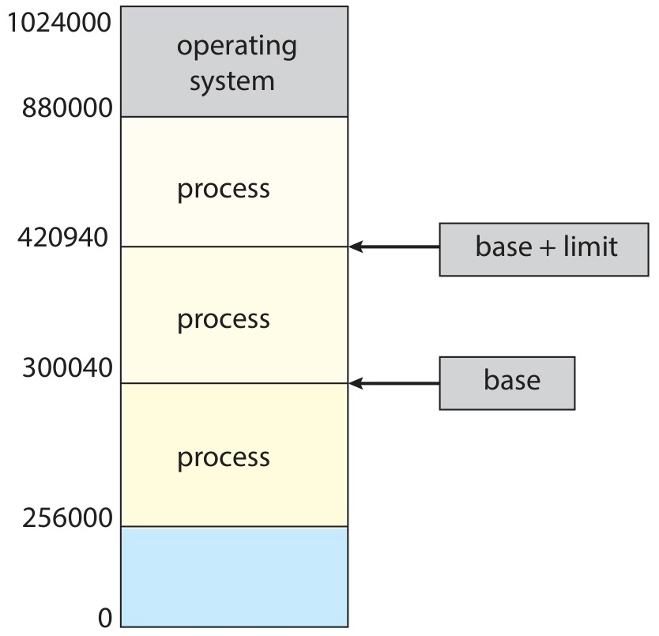
<p class="text-xs text-gray-500 text-center">Silberschatz, Figure 9.1 — A base and a limit register define a logical address space</p>
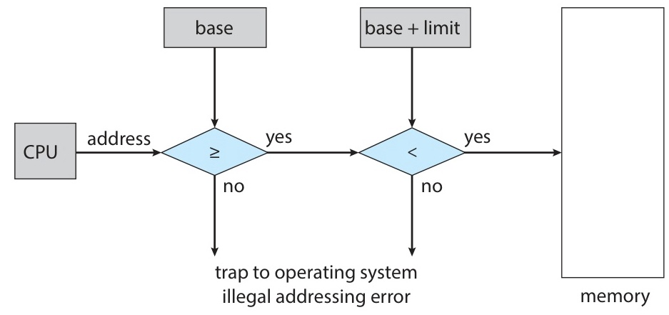
<p class="text-xs text-gray-500 text-center">Silberschatz, Figure 9.2 — Hardware address protection with base and limit registers</p>

</div>

- If Base = 300040, Limit = 120900, then accessible range: 300040 ~ 420939
- Base/limit registers can only be modified in **kernel mode** (privileged instructions)

---

# Address Binding

<div class="text-left text-lg leading-10">

Classification based on when a program's addresses are determined

</div>

| Timing | Description | Characteristics |
|--------|-------------|-----------------|
| **Compile time** | Memory start address fixed at compile time | Generates absolute code; recompilation needed if start address changes |
| **Load time** | Start address fixed at load time | Generates relocatable code |
| **Execution time** | Address binding performed during execution | Requires **MMU** hardware; used by most modern OSes |

---

# Multistep Processing of a User Program

<div class="text-left text-base leading-8">

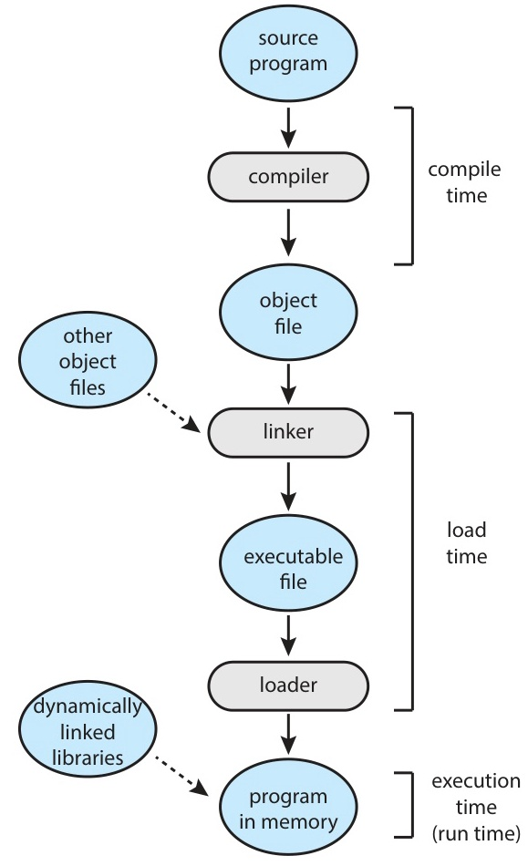
<p class="text-xs text-gray-500 text-center">Silberschatz, Figure 9.3 — Multistep processing of a user program</p>

</div>

- Symbolic address -> Relocatable address -> Absolute address
- Address space mapping (binding) occurs at each stage

---

# Logical vs Physical Address

<div class="text-left text-lg leading-10">

Distinguishing two address spaces

- **Logical address** (= virtual address)
  - Address generated by the CPU
  - Address space from the process's perspective (0 ~ max)

- **Physical address**
  - Address actually delivered to the memory device
  - Address loaded into the Memory Address Register (R+0 ~ R+max)

</div>

- Compile-time / Load-time binding: logical = physical
- **Execution-time binding**: logical != physical (translation required)

---

# MMU (Memory-Management Unit)

<div class="text-left text-lg leading-10">

**Hardware** that translates logical addresses to physical addresses

</div>

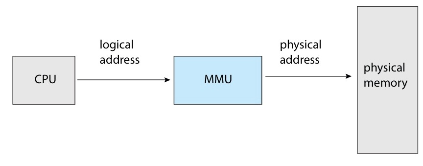
<p class="text-xs text-gray-500 text-center">Silberschatz, Figure 9.4 — Dynamic relocation using a relocation register</p>

- User programs use only logical addresses (0 ~ max)
- The actual physical address is translated by the MMU
- The relocation register value is added to every logical address

---

# Dynamic Loading

<div class="text-left text-lg leading-10">

A technique that loads a routine into memory **only when it is called**

- Code that is not used is not loaded
- Useful when large programs have many rarely called routines (e.g., error handling)
- The total program size is large, but the actually used (loaded) portion is small
- Can be implemented by the **programmer without special OS support**

</div>

```text
  Main Program (in memory)
  +-- routine_A() -> already loaded
  +-- routine_B() -> loaded on call
  +-- error_handler() -> loaded only on error (on disk)
```

---

# Dynamic Linking and Shared Libraries

<div class="text-left text-lg leading-10">

A technique that links libraries **at execution time**

- **Static Linking**: Library included in the executable file (increases file size)
- **Dynamic Linking**: Links DLL/Shared Library at execution time

</div>

Advantages of DLL (Dynamic-Link Library) / Shared Libraries:

| Aspect | Description |
|--------|-------------|
| Memory savings | Only one copy of the library code in memory, shared by multiple processes |
| Disk savings | No need to copy the library into each executable |
| Easy updates | No recompilation needed when replacing the library |
| Version management | Compatibility maintained through version information |

- **Stub**: A small piece of code that locates the library routine
- Dynamic linking requires OS support (due to memory protection)

---

# Static Linking vs Dynamic Linking

<div class="text-left text-base leading-8">

```text
  Static Linking                    Dynamic Linking
  +-----------------+               +-----------------+
  | Program A       |               | Program A       |
  | +-------------+ |               | (stub -> libc)  |
  | | libc copy 1 | |               +-----------------+
  | +-------------+ |                        |
  +-----------------+               +-----------------+
  | Program B       |               | Program B       |
  | +-------------+ |               | (stub -> libc)  |
  | | libc copy 2 | |               +-----------------+
  | +-------------+ |                        |
  +-----------------+               +-----------------+
                                    | libc (1 copy)   | <- shared
                                    +-----------------+

  libc 2MB x 40 processes           libc 2MB x 1 copy
  = 80MB memory usage               = 2MB memory usage
```

</div>

---
layout: section
---

# Part 2
## Contiguous Memory Allocation

---

# Contiguous Memory Allocation Overview

<div class="text-left text-lg leading-10">

A scheme that allocates **a single contiguous block of memory** to each process

- Memory is divided into OS area and user area
- Most OSes place the OS in high memory
- **Hole**: An available memory block (scattered in various sizes)
- When a process arrives, it is allocated to a hole of sufficient size

</div>

---

# Memory Protection with Relocation

<div class="text-left text-lg leading-10">

A protection mechanism combining Relocation register + Limit register

</div>

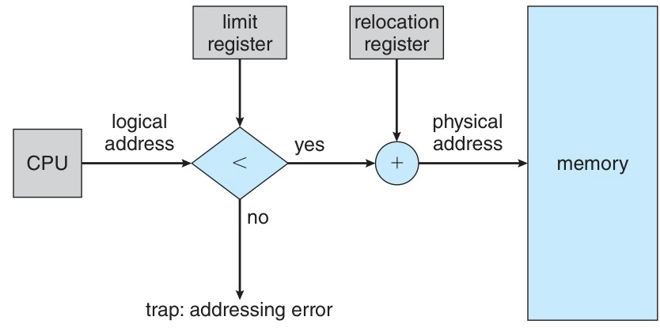
<p class="text-xs text-gray-500 text-center">Silberschatz, Figure 9.6 — Hardware support for relocation and limit registers</p>

- **Limit register**: Restricts the range of logical addresses
- **Relocation register**: Added to logical address to produce physical address
- The dispatcher sets both register values appropriately during context switch

---

# Variable Partition

<div class="text-left text-base leading-8">

A scheme that allocates variable-sized partitions to processes

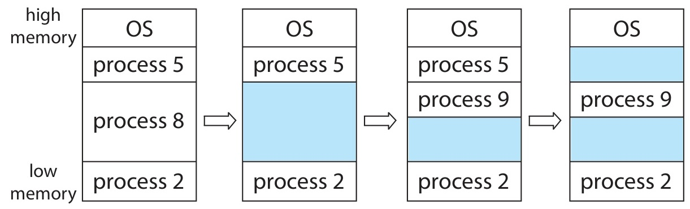
<p class="text-xs text-gray-500 text-center">Silberschatz, Figure 9.7 — Variable partition</p>

</div>

- When a process terminates, a hole is created; adjacent holes are merged
- Problem: Which hole should a process be placed in?

---

# Allocation Strategies: First-fit / Best-fit / Worst-fit

<div class="text-left text-lg leading-10">

**Dynamic Storage-Allocation Problem**: Which hole should a request of size n be allocated to?

</div>

| Strategy | Method | Characteristics |
|----------|--------|-----------------|
| **First-fit** | Allocate to the first sufficient hole | Fast, generally good performance |
| **Best-fit** | Allocate to the smallest sufficient hole | Produces smallest remaining hole, requires full search |
| **Worst-fit** | Allocate to the largest hole | Produces largest remaining hole, requires full search |

- Simulation results: First-fit and Best-fit outperform Worst-fit
- Between First-fit and Best-fit, First-fit is generally faster

---

# Allocation Strategy Example

<div class="text-left text-base leading-8">

Memory holes: 300KB, 600KB, 350KB, 200KB, 750KB, 125KB
Process requests: P1=115KB, P2=500KB, P3=358KB, P4=200KB, P5=375KB

```text
  First-fit:
    P1(115) -> 300KB hole  |  P2(500) -> 600KB hole
    P3(358) -> 750KB hole  |  P4(200) -> 200KB hole
    P5(375) -> allocation failed (remaining holes: 185, 100, 392, 125)

  Best-fit:
    P1(115) -> 125KB hole  |  P2(500) -> 600KB hole
    P3(358) -> 750KB hole  |  P4(200) -> 200KB hole
    P5(375) -> 392KB hole

  Worst-fit:
    P1(115) -> 750KB hole  |  P2(500) -> 635KB hole
    P3(358) -> allocation failed
```

</div>

---

# Fragmentation

<div class="text-left text-lg leading-10">

Two types of memory fragmentation

</div>

**External Fragmentation**

- Total available memory is sufficient but **contiguous space is lacking**
- **50-percent rule**: When N blocks are allocated, 0.5N blocks become unusable due to fragmentation
  - Approximately 1/3 of total memory becomes unusable

**Internal Fragmentation**

- **Leftover space** because the request size is smaller than the allocation unit
- Example: Allocation unit 4KB, request 3.5KB -> 0.5KB wasted

---

# Fragmentation Visualization

<div class="text-left text-base leading-8">

```text
  External Fragmentation             Internal Fragmentation
  +--------+                         +--------+
  |  P1    |                         |Allocated|  <- Request: 3.5KB
  +--------+                         | (3.5KB)|
  |  hole  | 50KB                    |--------|
  +--------+                         | Wasted |  <- Internal fragmentation: 0.5KB
  |  P2    |                         | (0.5KB)|
  +--------+                         +--------+  <- Allocation unit: 4KB
  |  hole  | 30KB
  +--------+
  |  P3    |        Request: 70KB
  +--------+        Available: 50+30 = 80KB (sufficient)
  |  hole  |        Contiguous: max 50KB (insufficient!)
  +--------+
```

</div>

---

# Compaction

<div class="text-left text-lg leading-10">

Solution for external fragmentation

- Move used memory to one side to **create a large contiguous free space**
- Only possible with **execution-time binding** (addresses can be dynamically relocated)
- Very expensive (requires moving all processes + updating base registers)

</div>

```text
  Before Compaction              After Compaction
  +--------+                  +--------+
  |  P1    |                  |  P1    |
  +--------+                  +--------+
  |  hole  |                  |  P2    |
  +--------+                  +--------+
  |  P2    |                  |  P3    |
  +--------+        ->        +--------+
  |  hole  |                  |        |
  +--------+                  |  hole  | <- large contiguous space
  |  P3    |                  |        |
  +--------+                  +--------+
```

- A better alternative: **Paging** (non-contiguous allocation)

---
layout: section
---

# Part 3
## Paging — Basic Method

---

# Paging Overview

<div class="text-left text-lg leading-10">

A technique that allocates a process's physical address space **non-contiguously**

- **Physical memory** -> divided into fixed-size **frames**
- **Logical memory** -> divided into same-size **pages**
- **Page table**: maps page number -> frame number
- **Completely eliminates** external fragmentation
- Internal fragmentation occurs only in the last page (average 0.5 page)

</div>

- Page size = Frame size (typically 4KB ~ 1GB, power of 2)
- The OS manages physical memory allocation state using a **frame table**

---

# Paging — Address Translation Principle

<div class="text-left text-lg leading-10">

Logical address structure (page size = 2^n, address space = 2^m)

</div>

```text
  Logical Address (m bits)
  +-------------------+------------------+
  | Page number (p)   | Page offset (d)  |
  |    (m-n bits)     |    (n bits)      |
  +-------------------+------------------+

  Translation process:
  1. Use p as the index into the page table
  2. Obtain frame number f from the page table
  3. Replace p with f -> physical address

  Physical Address
  +-------------------+------------------+
  | Frame number (f)  | Page offset (d)  |
  +-------------------+------------------+
```

- Offset d **does not change** during translation

---

# Paging Hardware

<div class="text-left text-base leading-8">

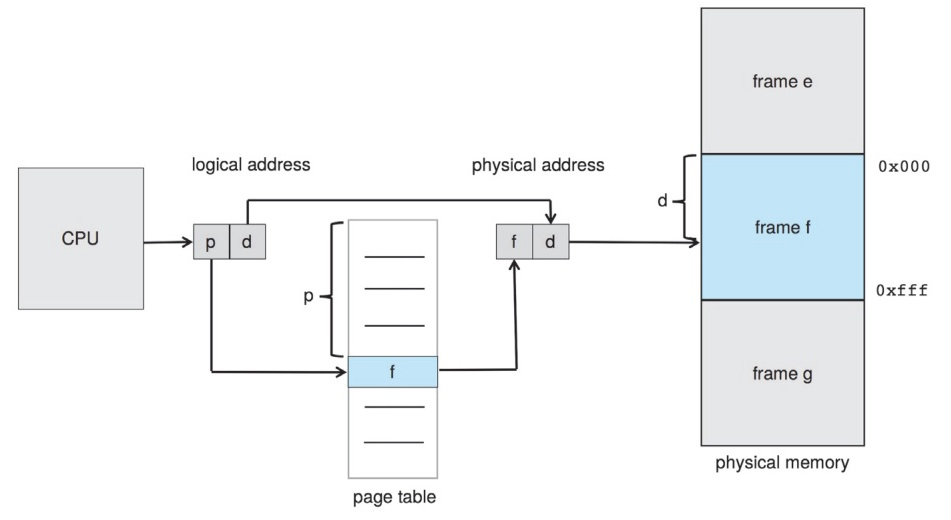
<p class="text-xs text-gray-500 text-center">Silberschatz, Figure 9.8 — Paging hardware</p>

</div>

- When the CPU generates a logical address, the MMU consults the page table for translation
- Each process maintains a **separate page table**

---

# Paging Example (32-byte memory, 4-byte pages)

<div class="text-left text-base leading-8">

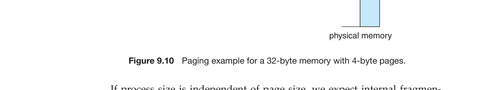
<p class="text-xs text-gray-500 text-center">Silberschatz, Figure 9.10 — Paging model of logical and physical memory</p>

</div>

---

# Free-Frame Management

<div class="text-left text-base leading-8">

Frames are allocated from the free frame list when a process is assigned

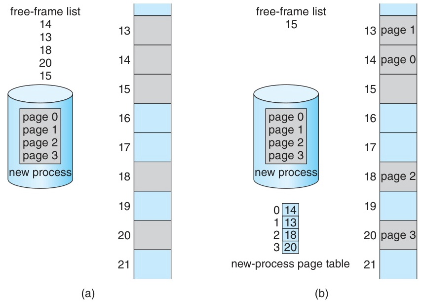
<p class="text-xs text-gray-500 text-center">Silberschatz, Figure 9.11 — Free frames before and after allocation</p>

</div>

---

# Internal Fragmentation in Paging

<div class="text-left text-lg leading-10">

Analysis of internal fragmentation in paging

- Page size = 2,048 bytes, Process size = 72,766 bytes
- Required pages: 72,766 / 2,048 = 35 pages + 1,086 bytes
- Allocation: **36 frames** -> Internal fragmentation = 2,048 - 1,086 = **962 bytes**
- Worst case: n pages + 1 byte -> n+1 frames allocated -> nearly 1 frame wasted

</div>

Trade-off when choosing page size:

| Small page size | Large page size |
|-----------------|-----------------|
| Less internal fragmentation | More internal fragmentation |
| Larger page table | Smaller page table |
| More I/O required | More efficient I/O |

- Today: typically **4KB** or **8KB**; some systems support 2MB, 1GB huge pages

---
layout: section
---

# Part 4
## Paging — Hardware Support (TLB)

---

# Hardware Implementation of Page Tables

<div class="text-left text-lg leading-10">

Hardware approaches for accessing the page table

</div>

**Method 1: Dedicated Registers**
- Store the page table in high-speed hardware registers
- Advantage: Very fast translation
- Disadvantage: Only feasible when the page table is small (e.g., 256 entries)

**Method 2: PTBR (Page-Table Base Register)**
- Store the page table in **memory**, with PTBR pointing to its start address
- Only PTBR needs to be changed during context switch (fast switching)
- Problem: **Two memory accesses** required (page table once + data once)

---

# TLB (Translation Look-aside Buffer)

<div class="text-left text-lg leading-10">

A high-speed associative memory that serves as a **cache** for the page table

- Size: typically 32 ~ 1,024 entries
- **Key-Value** structure: page number -> frame number
- All keys compared **simultaneously** (parallel search)
- TLB lookup is part of the CPU instruction pipeline -> no performance penalty

</div>

```text
  TLB Hit/Miss process:

  CPU -> p,d -> Search for p in TLB
                |
          +-----+-----+
          |           |
       TLB hit     TLB miss
          |           |
     f obtained    Fetch f from
     immediately   page table, then
          |        add (p,f) to TLB
          |           |
          +-----+-----+
                |
         f + d -> physical address -> Memory
```

---

# TLB with Paging Hardware

<div class="text-left text-base leading-8">

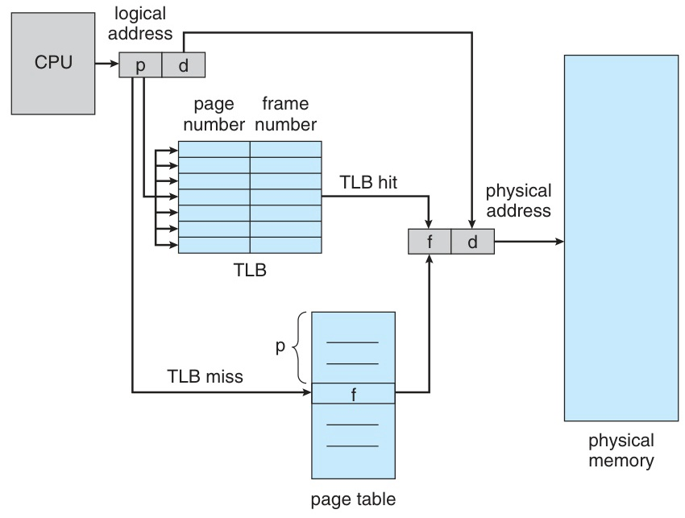
<p class="text-xs text-gray-500 text-center">Silberschatz, Figure 9.12 — Paging hardware with TLB</p>

</div>

- When the TLB is full, existing entries are replaced (LRU, Round-Robin, Random)
- Some entries are **wired down** (for kernel code, non-replaceable)

---

# ASID (Address-Space Identifier)

<div class="text-left text-lg leading-10">

A scheme that includes a **process identifier (ASID)** in TLB entries

</div>

| TLB without ASID | TLB with ASID |
|-------------------|---------------|
| Entire TLB **flushed** on context switch | No flush needed on context switch |
| Prevents use of stale mappings from previous process | ASID distinguishes processes |
| Performance degradation (TLB miss surge at new process start) | TLB entries from multiple processes can coexist |

```text
  TLB entry with ASID:
  +------+------+------+
  | ASID |  p   |  f   |
  +------+------+------+
  |  P1  |  3   |  7   |  <- Process 1's page 3 -> frame 7
  |  P2  |  3   |  12  |  <- Process 2's page 3 -> frame 12
  +------+------+------+
```

---

# Effective Access Time (EAT)

<div class="text-left text-lg leading-10">

Quantitative analysis of TLB performance

</div>

- **Hit ratio (alpha)**: Probability of finding the page number in the TLB
- **Memory access time**: Time for one memory access
- **TLB access time**: Time for one TLB lookup

**EAT formula:**
```text
  EAT = alpha x (TLB access + Memory access)
      + (1 - alpha) x (TLB access + 2 x Memory access)
```

---

# EAT Calculation Examples

<div class="text-left text-lg leading-10">

Example: Memory access = 100ns, TLB access = 10ns

</div>

**Case 1: Hit ratio = 80%**
```text
  EAT = 0.80 x (10 + 100) + 0.20 x (10 + 200)
      = 0.80 x 110 + 0.20 x 210
      = 88 + 42 = 130ns   (30% slowdown)
```

**Case 2: Hit ratio = 98%**
```text
  EAT = 0.98 x (10 + 100) + 0.02 x (10 + 200)
      = 0.98 x 110 + 0.02 x 210
      = 107.8 + 4.2 = 112ns   (approx. 2% slowdown)
```

**Case 3: Hit ratio = 99%** (realistic value)
```text
  EAT = 0.99 x 110 + 0.01 x 210
      = 108.9 + 2.1 = 111ns   (approx. 1% slowdown)
```

- The higher the hit ratio, the closer to raw memory access time!

---
layout: section
---

# Part 5
## Paging — Protection & Shared Pages

---

# Protection in Page Tables

<div class="text-left text-lg leading-10">

Memory protection by adding **protection bits** to each page table entry

</div>

**Protection Bits:**
- **Read-only / Read-write** bit: Whether writing is allowed
- **Execute** bit: Whether code execution is allowed
- Violation -> hardware trap -> OS handles it

**Valid-Invalid Bit:**
- **Valid**: The page belongs to the process's logical address space
- **Invalid**: Access not allowed (page not in use)
- Accessing an invalid page -> trap to OS (invalid page reference)

---

# Valid-Invalid Bit Example

<div class="text-left text-base leading-8">

14-bit address space (0~16383), page size = 2KB, program uses 0~10468

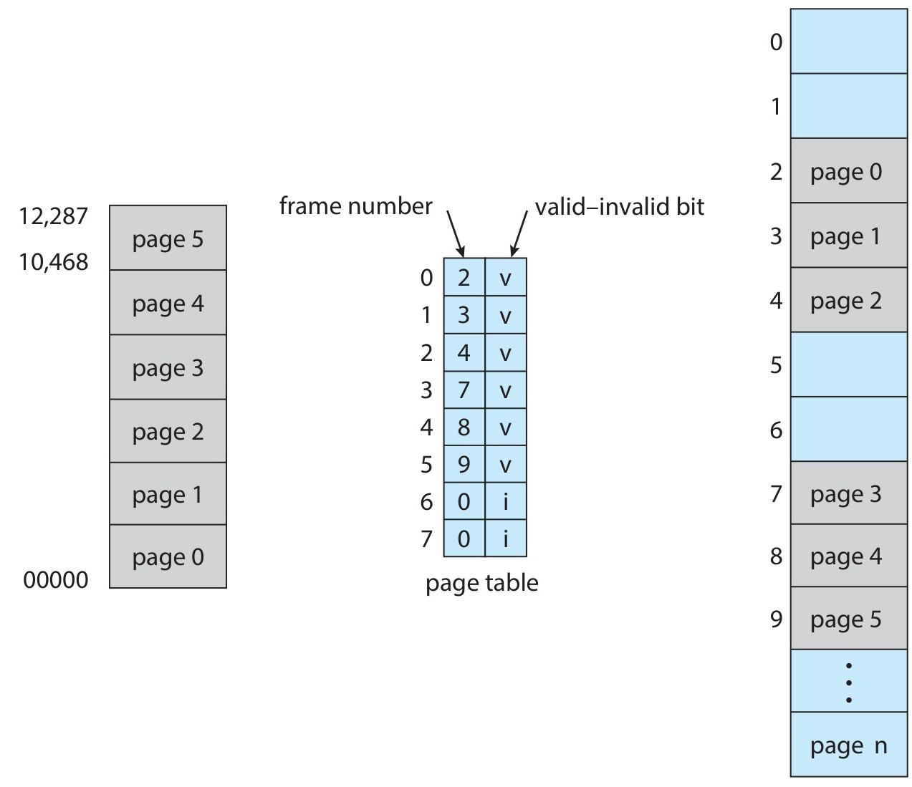
<p class="text-xs text-gray-500 text-center">Silberschatz, Figure 9.13 — Valid (v) or invalid (i) bit in a page table</p>

</div>

- **PTLR** (Page-Table Length Register): Limits the page table size to eliminate unnecessary entries

---

# Shared Pages

<div class="text-left text-lg leading-10">

Multiple processes running the same code **share the same frames**

Condition: The code must be **reentrant (read-only)**

</div>

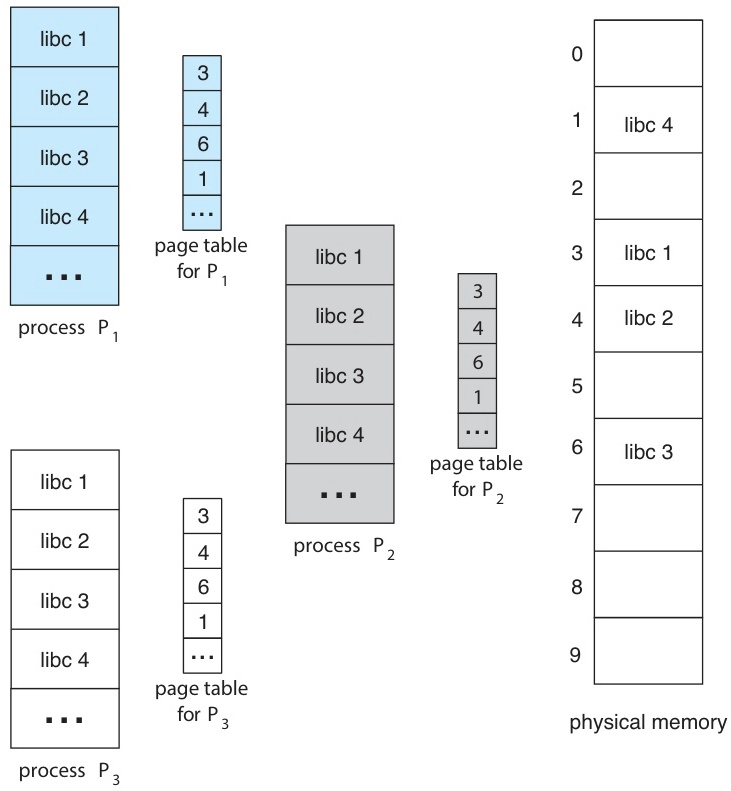
<p class="text-xs text-gray-500 text-center">Silberschatz, Figure 9.14 — Sharing of standard C library in a paging environment</p>

- Example: Text editor used by 40 users
  - Shared: code pages (libc 2MB) x 1 copy = **2MB**
  - Individual: data pages x 40 copies
  - vs. without sharing: 80MB (40 x 2MB)

---

# Shared Pages Details

<div class="text-left text-lg leading-10">

Applications of shared pages

- **System libraries** (libc, DLLs): The most common sharing targets
- **Compilers, Editors, Window systems**: Used by multiple users simultaneously
- **Database systems**: Shared common code
- **Shared memory for IPC**: Also used for inter-process communication

</div>

Important notes:

- Shared code must be **read-only**
- The OS **enforces** the read-only property (using protection bits)
- Each process's data/stack pages are maintained individually

---
layout: section
---

# Part 6
## Page Table Structure

---

# The Problem of Large Page Tables

<div class="text-left text-lg leading-10">

Page table size analysis for a 32-bit address space

</div>

```text
  32-bit logical address, 4KB page (2^12)
  -> Page table entries = 2^32 / 2^12 = 2^20 = approx. 1,048,576
  -> Each entry 4 bytes -> Page table size = 4MB (per process!)

  64-bit logical address, 4KB page
  -> Page table entries = 2^64 / 2^12 = 2^52 ~ 4 x 10^15
  -> Each entry 8 bytes -> Page table size = 32PB (!!!)
```

- Difficult to place a 4MB page table contiguously in memory
- Solutions:
  1. **Hierarchical Paging** (multi-level paging)
  2. **Hashed Page Table**
  3. **Inverted Page Table**

---

# Hierarchical Paging (Two-Level)

<div class="text-left text-lg leading-10">

A technique that pages the page table itself

</div>

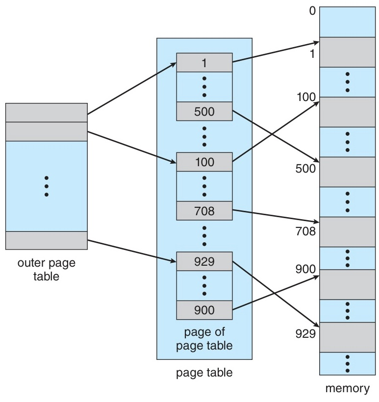
<p class="text-xs text-gray-500 text-center">Silberschatz, Figure 9.15 — A two-level page-table scheme</p>

- p1: Index into the outer page table (1024 entries)
- p2: Index into the inner page table (1024 entries)
- d: Offset within the page (4096 bytes)
- Also called a **forward-mapped page table**

---

# Two-Level Page Table Operation

<div class="text-left text-base leading-8">

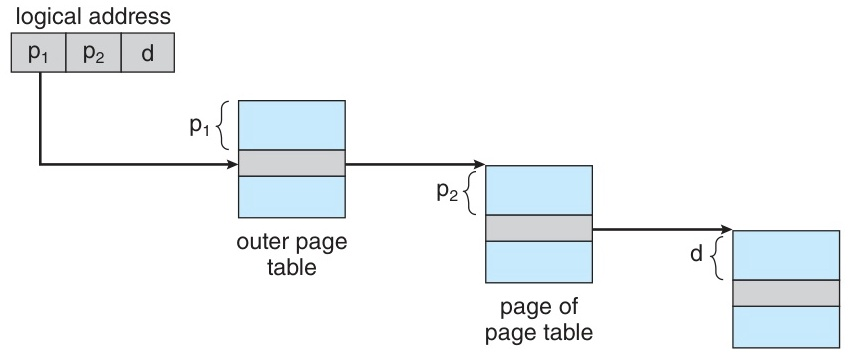
<p class="text-xs text-gray-500 text-center">Silberschatz, Figure 9.16 — Address translation for a two-level 32-bit paging architecture</p>

</div>

Advantages:
- Inner page tables for unused address space regions are **not loaded into memory**
- Only the actually used portions consume memory, not the full 4MB

---

# Limitations of Hierarchical Paging in 64-bit

<div class="text-left text-lg leading-10">

Problems with two-level paging in a 64-bit address space

</div>

```text
  64-bit address, 4KB page, two-level:
  +----------+----------+----------+
  |    p1    |    p2    |    d     |
  | (42 bit) | (10 bit) | (12 bit) |
  +----------+----------+----------+

  Outer page table = 2^42 entries = 2^44 bytes (16TB!)
  -> Still too large

  Three-level:
  +-------+-------+-------+-------+
  |  p1   |  p2   |  p3   |   d   |
  | (32)  | (10)  | (10)  | (12)  |
  +-------+-------+-------+-------+

  Outer page table = 2^32 entries = 2^34 bytes (16GB!)
  -> Still too large... would need 7 levels -> impractical
```

- Hierarchical paging is unsuitable for 64-bit systems
- Alternatives: **Hashed Page Table** or **Inverted Page Table**

---

# Hashed Page Tables

<div class="text-left text-lg leading-10">

A page table structure suitable for address spaces of 32 bits or more

</div>

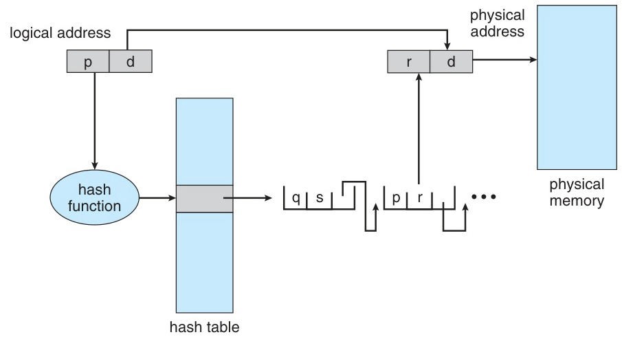
<p class="text-xs text-gray-500 text-center">Silberschatz, Figure 9.17 — Hashed page table</p>

- **Clustered page table**: A single entry stores mappings for multiple pages
  - Efficient for sparse address spaces

---

# Inverted Page Tables

<div class="text-left text-lg leading-10">

A structure that maintains a single global table based on **frames**

</div>

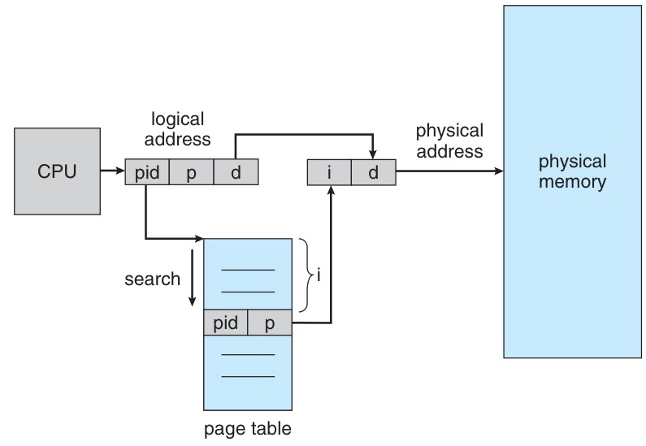
<p class="text-xs text-gray-500 text-center">Silberschatz, Figure 9.18 — Inverted page table</p>

- Advantage: Significant memory savings (no per-process page table needed)
- Disadvantage: Slow search (full table scan required) -> mitigated with **hash table**
- Limitation: Shared pages are difficult to implement (1 physical page = 1 virtual mapping)

---

# Page Table Structure Comparison

<div class="text-left text-base leading-8">

| Structure | Advantages | Disadvantages | Suitable For |
|-----------|-----------|---------------|-------------|
| **Single-level** | Simple, fast | Large table size | Small address space |
| **Hierarchical** | Saves on unused regions | Too many levels for 64-bit | 32-bit systems |
| **Hashed** | Handles large address spaces | Hash collision overhead | 64-bit, sparse spaces |
| **Inverted** | Based on physical memory, space-saving | Slow search, difficult shared pages | Large physical memory |

</div>

---
layout: section
---

# Part 7
## Swapping

---

# Standard Swapping

<div class="text-left text-lg leading-10">

Exchanging an entire process between memory and disk (backing store)

</div>

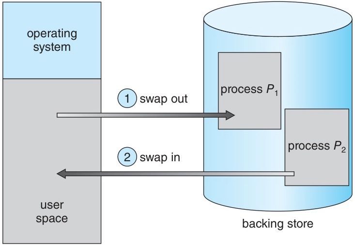
<p class="text-xs text-gray-500 text-center">Silberschatz, Figure 9.19 — Standard swapping of two processes using a disk as a backing store</p>

- **Swap out**: Move entire process from memory -> disk
- **Swap in**: Restore entire process from disk -> memory
- Disadvantage: Transfer time is very large -> rarely used in modern OSes

---

# Swapping with Paging (Modern OS)

<div class="text-left text-lg leading-10">

A method that swaps out/in at the **page level** (the modern OS standard)

- Only **needed pages** are exchanged, not the entire process
- Much more efficient and faster
- **Page out**: Memory -> backing store
- **Page in**: Backing store -> memory

</div>

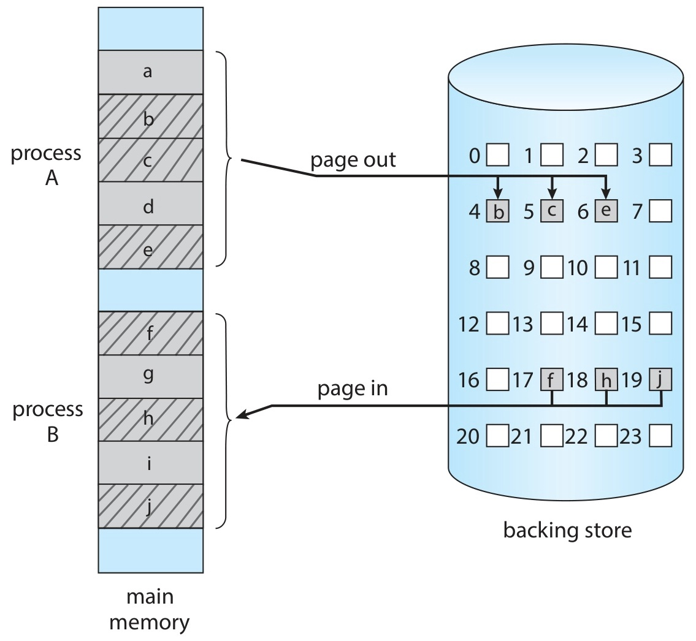
<p class="text-xs text-gray-500 text-center">Silberschatz, Figure 9.20 — Swapping with paging</p>

- Covered in detail later in **Virtual Memory** (Ch 10)

---

# Swapping on Mobile Systems

<div class="text-left text-lg leading-10">

Swapping on mobile systems

- Most mobile OSes **do not support** swapping
- Reasons:
  - **Limited write cycles** of flash memory (lifespan concern)
  - **Low throughput** between flash memory and main memory
  - **Storage space** constraints

</div>

**iOS**: Requests apps to voluntarily release memory when memory is low; terminates apps that do not comply

**Android**: Saves **app state to flash** before terminating processes when memory is low -> enables fast restart

---
layout: section
---

# Part 8
## Real-World Architectures

---

# IA-32 Architecture (32-bit x86)

<div class="text-left text-lg leading-10">

**Segmentation + Paging** combined approach

</div>

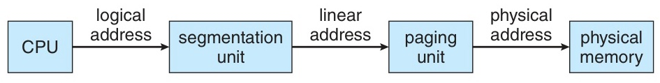
<p class="text-xs text-gray-500 text-center">Silberschatz, Figure 9.21 — Logical to physical address translation in IA-32</p>

- When using 4MB pages: Page Directory directly points to a 4MB frame

---

# IA-32 PAE (Page Address Extension)

<div class="text-left text-lg leading-10">

An extension that allows 32-bit processors to access more than 4GB of physical memory

</div>

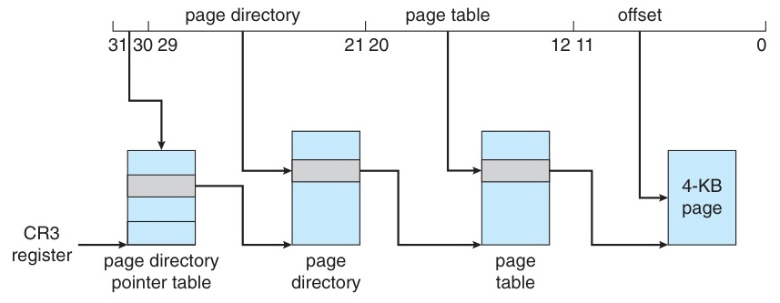
<p class="text-xs text-gray-500 text-center">Silberschatz, Figure 9.24 — Page address extensions</p>

- Page table entry expanded from 32-bit to **64-bit**
- Base address: 20-bit -> **24-bit** (+ 12-bit offset = 36-bit physical address)
- Linux and macOS support PAE; 32-bit Windows desktop still limited to 4GB

---

# x86-64 Architecture

<div class="text-left text-lg leading-10">

64-bit extension architecture (based on AMD64, also adopted by Intel)

</div>

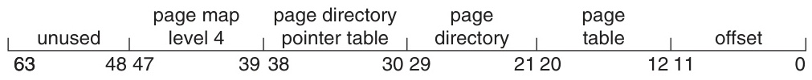
<p class="text-xs text-gray-500 text-center">Silberschatz, Figure 9.25 — x86-64 linear address</p>

- **48-bit** virtual address space = 256TB
- **52-bit** physical address (PAE extension) = 4PB
- Page size: **4KB**, **2MB**, **1GB**
- Segmentation effectively disabled

---

# ARMv8 Architecture (64-bit ARM)

<div class="text-left text-lg leading-10">

The most widely used 64-bit architecture in mobile/embedded systems

</div>

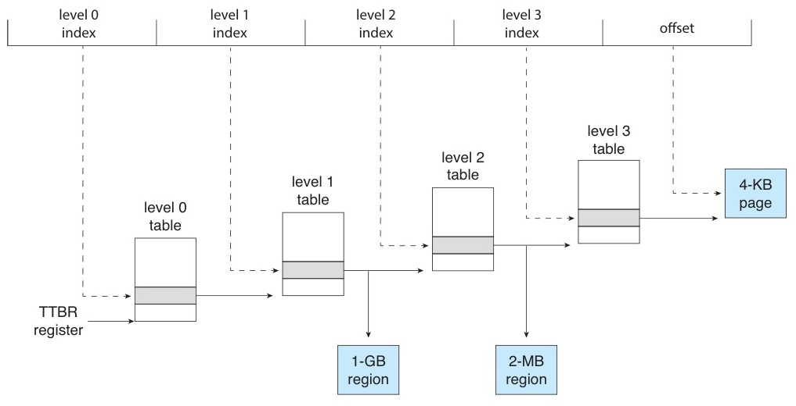
<p class="text-xs text-gray-500 text-center">Silberschatz, Figure 9.26 — ARM 4-KB translation granule</p>

| Translation Granule | Page Size | Region Size |
|-------------------|-----------|-------------|
| 4 KB | 4 KB | 2 MB, 1 GB |
| 16 KB | 16 KB | 32 MB |
| 64 KB | 64 KB | 512 MB |

- **2-level TLB**: micro TLB (instruction + data) + main TLB
- ASID support

---

# Architecture Comparison Summary

<div class="text-left text-base leading-8">

| Feature | IA-32 | x86-64 | ARMv8 |
|---------|-------|--------|-------|
| Address size | 32-bit | 48-bit virtual | 48-bit virtual |
| Paging levels | 2-level (3 with PAE) | 4-level | Up to 4-level |
| Page sizes | 4KB, 4MB | 4KB, 2MB, 1GB | 4KB, 16KB, 64KB |
| Segmentation | Used | Effectively disabled | None |
| Physical memory | 4GB (64GB w/ PAE) | 4PB (52-bit) | Up to 48-bit |
| TLB | Present | Multi-level | 2-level |

</div>

---
layout: section
---

# Lab
## Memory Allocation Simulator

---

# Lab — Memory Allocation Simulator (1)

Comparing First-fit, Best-fit, and Worst-fit

<div class="text-left text-lg leading-10">

**Objective**: Manage a memory block list and compare three allocation algorithms

**Implementation requirements**:
- Represent memory as a block list (start address, size, status)
- Process allocation request: Allocate using each of the three algorithms
- Process release request: Coalesce adjacent free blocks
- Output: Memory state, allocation success/failure, external fragmentation size

</div>

---

# Lab — Memory Allocation Simulator (2)

<div class="text-left text-base leading-8">

**Data structure design**:

```c
typedef struct Block {
    int start;        // Start address
    int size;         // Block size
    int allocated;    // 0: free, 1: allocated
    char process[10]; // Process name
    struct Block* next;
} Block;
```

**Key functions**:

```c
Block* first_fit(Block* head, int size);   // First sufficient hole
Block* best_fit(Block* head, int size);    // Smallest sufficient hole
Block* worst_fit(Block* head, int size);   // Largest hole
void release(Block* head, char* process);  // Release + coalesce
void print_memory(Block* head);            // Print memory state
```

</div>

---

# Lab — Memory Allocation Simulator (3)

Input and output example

```text
Input:
  Memory size: 1024
  Allocate P1: 200
  Allocate P2: 350
  Allocate P3: 150
  Release P2
  Allocate P4: 300

Output (First-fit):
  [  0- 199] P1 (200)
  [200- 549] FREE (350)    <- P2 released
  [550- 699] P3 (150)
  [700-1023] FREE (324)

  Allocate P4(300) -> First-fit: [200-499] P4
  [  0- 199] P1 (200)
  [200- 499] P4 (300)
  [500- 549] FREE (50)     <- remaining hole
  [550- 699] P3 (150)
  [700-1023] FREE (324)

  External fragmentation: 50 + 324 = 374 bytes
```

---

# Summary

<div class="text-left text-lg leading-10">

Key points from this week

- **Address Binding**: compile time / load time / execution time
- **Logical vs Physical address**: MMU performs the translation
- **Contiguous Allocation**: First-fit, Best-fit, Worst-fit
- **Fragmentation**: External (lack of contiguous space) / Internal (waste within allocation unit)
- **Paging**: page -> frame mapping, page table, TLB for performance improvement
- **Page Table Structure**: Hierarchical / Hashed / Inverted
- **Swapping**: standard (entire process) vs paging (page-level)
- **Real-World**: IA-32 (segmentation+paging), x86-64 (4-level), ARMv8 (4-level)

</div>

---

# Next Week Preview

<div class="text-left text-lg leading-10">

**Week 12: Virtual Memory (Ch 10)**

- Demand Paging
- Copy-on-Write
- Page Replacement Algorithms (FIFO, Optimal, LRU)
- Allocation of Frames
- Thrashing
- Memory-Mapped Files

</div>

